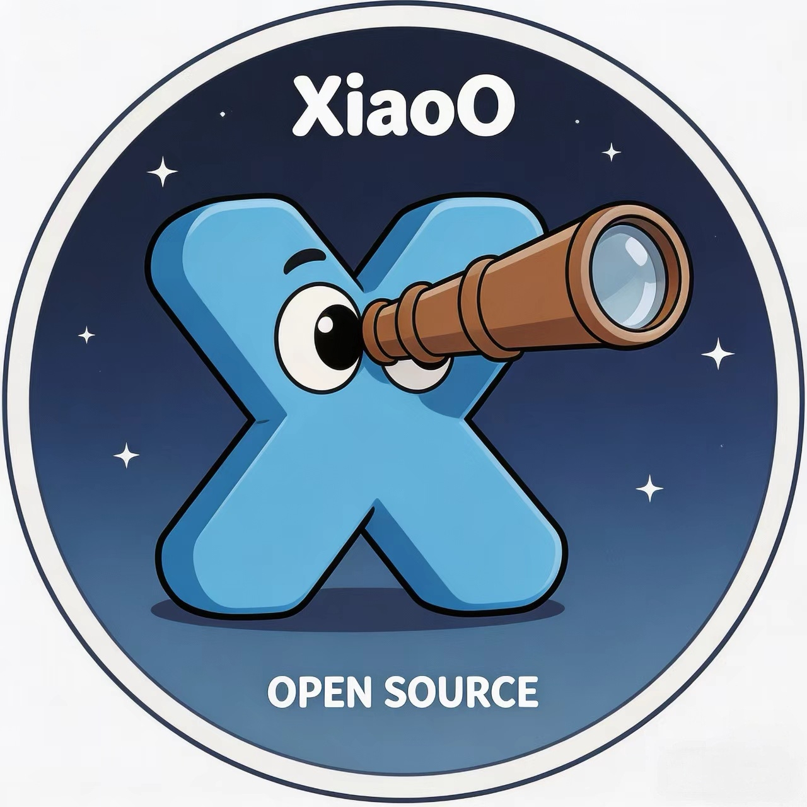

<div align="center">
  
</div>

# xiaoO - Open-source Intelligence Hub of AgentOS
## What is xiaoO?
It is the intelligence hub of AgentOS, delivering self-governing system management, seamless agent orchestration, and ready-to-use smart capabilities across all user channels. xiaoO turns the entire OS into the agent's home — every resource, every service, every capability, curated and served under one roof.

At the runtime core, xiaoO ships a layered memory system and an adaptive context compression engine, so agents can stay stable across long conversations, tool-heavy execution, and multi-agent collaboration instead of collapsing under raw history growth.

[](./License)
[](https://www.rust-lang.org/)
<a href="https://gitcode.com/openeuler/xiaoO"></a>
---

## Memory & Context

The highlights below focus specifically on xiaoO's memory system and context compression architecture:

- **Layered Memory System**: xiaoO separates live working memory, structured session memory, durable memory, and semantic recall instead of treating context as one flat transcript.
- **Adaptive Context Compression**: the runtime analyzes token pressure before each turn and can microcompact tool noise, trim stale history, collapse old context into summaries, and auto-recover from context-window overflow.
- **Memory Self-Evolution**: memory is continuously refreshed, deduplicated, summary-merged, correction-aware, and able to rebuild semantic indexes when the embedding stack changes.
- **Hybrid Semantic Memory**: the architecture supports lightweight JSON persistence as well as SQLite + FTS5 + embedding-based hybrid retrieval.
- **Multi-Agent Memory Isolation**: each execution lane keeps its own loop state and memory snapshot, preventing context pollution across collaborating agents.
- **Traceable Runtime**: compression, prompt building, and execution can be traced end-to-end with Moirai-backed observability.

Read the full architecture, configuration, and integration guide in [Memory & Context Compression](./docs/memory_context_system.md).


## Prerequisites
- Cargo >= 1.7 installed

## Installation (From Source)

```bash
git clone https://gitcode.com/openeuler/xiaoO.git
cd xiaoO
cargo build --release
cargo install --path apps/xiaoo-app
```

Install to `~/.cargo/bin/xiaoo`, and ensure that `~/.cargo/bin` is in `PATH`.

For plugin installation and usage, please refer to [plugins.md](./docs/plugins.md).

## Quick Start
Create the configuration file `~/.config/xiaoo/config.toml`

```toml
[llm]
provider = "openrouter" # openai, anthropic, ollama, openrouter, deepseek, zai, ...
model = "z-ai/glm-5"
api_key_env = "OPENROUTER_API_KEY" # Read the API key from this environment variable
max_tokens = 128000  # Optional: max output tokens per response, defaults to 128000
context_window = 128000 # Optional, used for session compression budget

[trace]
storage_backend = "moirai-sqlite"    # noop/stdout/moirai-sqlite
db_path = "/root/.config/xiaoo/traces.db"    # 仅当storage_backend 为 moirai-sqlite 时生效；未配置时为 ~/.moirai

```

Set environment variables

```bash
export OPENROUTER_API_KEY="sk-or-..."
```

```bash
# TUI Command
xiaoo-tui

# CLI Command
xiaoo run -p "Your Command"
```

In TUI, press `Tab` / `Shift+Tab` to switch agent role presets. When the current line starts with a slash command, `Tab` still performs slash completion.

HTTP requests can also select an agent role preset by passing `agent` in the JSON body:

```json
{
  "text": "Review this patch for security issues",
  "channel": "http",
  "sender_id": "demo-user",
  "conversation_id": "demo-conv",
  "agent": "code-reviewer"
}
```
Example

```
$ xiaoo run -p 'Count "hello world" char numbers'
"hello world" has 11 chars.
```
## Run as Daemon

The Gateway operates in **daemon mode**, providing a RESTful API for external systems (such as Lark Webhook) to access.

```bash
# default port（0.0.0.0:18080）
xiaoo-app daemon

# Specify configuration file, address and port
xiaoo-app daemon --config /path/to/config.toml --host 127.0.0.1 --port 18080
```

More config details in [daemon.md](./docs/daemon_config.md)

Feishu channel setup guide in [feishu_deploy.md](./docs/feishu_deploy.md)
