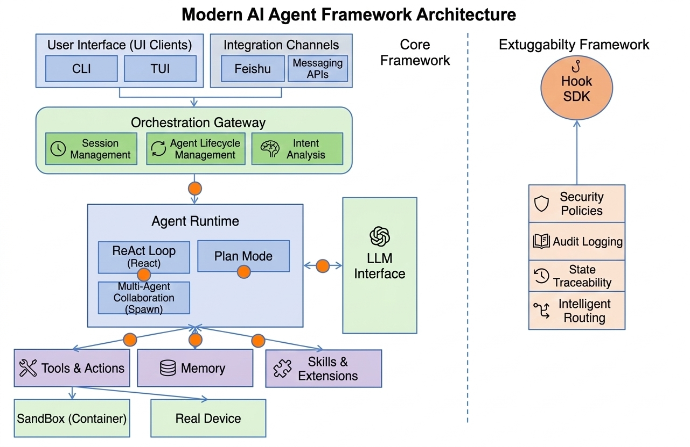

# xiaoO

**智能体框架** — 自主节点，可扩展集群。安全、可观测、OpenClaw 兼容。

[](./License)
[](https://www.rust-lang.org/)

---

## Overview

XiaoO 是基于 Rust 的 **智能体框架**，为 AI 智能体提供安全、可观测、可扩展的执行环境，同时遵循 OpenClaw 的智能体定义规范。

- **OpenClaw 兼容**：智能体定义（人设、流程、记忆）遵循 OpenClaw Workspace 规范。XiaoO 负责加载并运行这些定义。
- **运行时与定义分离**：Runtime 提供基础设施（沙箱、记忆、网络）；Definition（Workspace 文件）定义智能体的人设、流程和知识。
- **LLM 集成**：OpenAI、Anthropic、Ollama、OpenRouter、DeepSeek、Z.AI、Gemini 等

## Architecture



## Installation

```bash
git clone https://gitcode.com/openeuler/xiaoO.git
cd xiaoO
cargo build --release
cargo install --path apps/xiaoo-app
```

安装到 `~/.cargo/bin/xiaoo`，确保 `~/.cargo/bin` 在 `PATH` 中。

## Quick Start

### 2. 配置

创建配置文件 `~/.config/xiaoo/config.toml`：

```toml
[llm]
provider = "openrouter"              # openai, anthropic, ollama, openrouter, deepseek, zai, ...
model = "z-ai/glm-5"
api_key_env = "OPENROUTER_API_KEY"   # 从此环境变量读取 API key
context_window = 128000              # 可选，用于会话压缩预算

[trace]
storage_backend = "moirai-sqlite"    # 可选；未配置时由 trace 模块内部决定默认值
db_path = "~/.config/xiaoo/traces.db"     # 可选；未配置时由 trace 模块内部决定默认值
```

设置环境变量：

```bash
export OPENROUTER_API_KEY="sk-or-..."
```

### 3. 运行

```bash
# TUI启动
xiaoo-tui

# CLI启动
xiaoo run -p "列出当前文件夹下的所有文件"

# 查看中间过程（turn、tool 调用、token 用量）
xiaoo --debug run -p "计算 hello 的字符数"

# 命令行参数覆盖配置文件
xiaoo run -p "hello" --provider ollama --model llama3

# 禁用工具（纯对话模式）
xiaoo run -p "什么是 Rust？" --no-tools

# 指定自定义配置文件
xiaoo --config /path/to/config.toml run -p "hello"
```

### 参数说明

**全局参数：**

| 参数 | 说明 |
|------|------|
| `--config <PATH>` | 指定配置文件路径（默认 `~/.config/xiaoo/config.toml`） |
| `--debug` | 输出中间过程（turn、tool 调用、token 用量） |

**`run` 子命令参数（CLI 参数优先于配置文件）：**

| 参数 | 说明 | 默认值 |
|------|------|--------|
| `-p, --prompt` | **必填**，发送给 Agent 的提示 | — |
| `--provider` | LLM 提供商 | `anthropic` |
| `--model` | 模型名称 | `claude-sonnet-4-20250514` |
| `--api-key` | API key（覆盖配置文件中的 env 方式） | — |
| `--api-base` | 自定义 API 地址 | — |
| `--system` | 系统提示词 | 内置默认 |
| `--max-turns` | 单次对话最大轮数 | `10` |
| `--no-tools` | 禁用工具执行 | `false` |

### 示例

```
$ xiaoo run -p '计算 "hello world" 的字符数'
"hello world" 共有 11 个字符。

$ xiaoo --debug run -p '计算 "hello world" 的字符数'
[config] loaded ~/.config/xiaoo/config.toml
[config] provider=openrouter, model=z-ai/glm-5, max_turns=10
[config] tools=11
--- turn 1 ---
  [tool] count_text_length (OK) => 11
--- turn 2 ---
[assistant] "hello world" 共有 11 个字符。
--- end (turns=2, tokens=4732, reason=complete) ---
"hello world" 共有 11 个字符。
[done] turns=2, tokens=4732
```

## Skills

Skills 是 prompt-based 的可复用指令集。LLM 通过内置的 `skill` 工具自动调用已注册的 skill。

### Skill 目录

Skills 默认从 `~/.xiaoo/skills/` 自动加载。每个子目录包含一个 `SKILL.md` 或 `SKILL.toml` 即为一个 skill：

```
~/.xiaoo/skills/
├── code-review/
│   └── SKILL.md
├── lint-runner/
│   └── SKILL.toml
└── ...
```

可在 `~/.config/xiaoo/config.toml` 中添加额外的 skill 目录：

```toml
[skills]
dirs = ["/path/to/team-skills", "/path/to/project-skills"]
```

### SKILL.md 格式

```markdown
---
name: code-review
description: Review code for quality and security issues
version: "1.0"
arguments: [target]
argument-hint: "[file or directory path]"
---

Review the code at $target for:
1. Security vulnerabilities
2. Performance issues
3. Code style violations

Use grep and file_read to examine the code, then provide a structured report.
```

**Frontmatter 字段说明：**

| 字段 | 类型 | 默认值 | 说明 |
|------|------|--------|------|
| `name` | string | 目录名 | Skill 名称 |
| `description` | string | 自动从 body 提取 | 简要描述，展示在 skill 列表中 |
| `version` | string | — | 版本号 |
| `user-invocable` | bool | `true` | 用户能否手动调用 |
| `disable-model-invocation` | bool | `false` | 禁止 LLM 自动调用 |
| `context` | string | `inline` | 执行模式：`inline`（展开到对话）或 `fork`（子 agent） |
| `arguments` | list | `[]` | 命名参数列表，prompt 中用 `$arg_name` 引用 |
| `argument-hint` | string | — | 参数提示文本 |
| `paths` | list | `[]` | 条件激活 glob 模式 |

> `description` 未填写时，会自动从 markdown body 中提取第一段非标题文本。

### 管理命令

```bash
# 列出已安装的 skills
xiaoo skill list

# 查看 skill 详细信息和 prompt 内容
xiaoo skill show <name>

# 安全审计一个 skill 目录
xiaoo skill audit <path>

# 从本地目录安装（自动审计）
xiaoo skill install ./my-skill/

# 从 Git 仓库安装
xiaoo skill install https://github.com/user/my-skill.git

# 移除已安装的 skill
xiaoo skill remove <name>
```

### 安全审计

安装前会自动执行安全审计，检测：
- 符号链接
- 脚本文件（`.sh`/`.bash` 等，除非配置 `allow_scripts = true`）
- 高危命令模式（`rm -rf /`、`sudo`、`curl | sh` 等）
- Shell 链接操作符（`&&`、`||`、`;`）
- 超大文件

### 运行时行为

Agent 运行时，已加载的 skills 会出现在 system prompt 中。LLM 可通过 `skill` 工具调用它们：

```
用户: 帮我 review 一下 src/main.rs
LLM → 调用 skill 工具: { skill: "code-review", args: "src/main.rs" }
     → skill prompt 展开（$target → src/main.rs）
     → LLM 根据 prompt 使用 grep/file_read 等工具完成 review
```

## Gateway HTTP API

Gateway 以 **daemon 模式**运行，提供 RESTful API 供外部系统（如飞书 Webhook）接入。

### 启动 Gateway Daemon

```bash
# 使用默认配置启动（监听 0.0.0.0:8080）
xiaoo-app daemon

# 指定配置文件、地址和端口
xiaoo-app daemon --config /path/to/config.toml --host 127.0.0.1 --port 18080
```

**`daemon` 命令参数：**

| 参数 | 说明 | 默认值 |
|------|------|--------|
| `--config <PATH>` | 配置文件路径（也支持 `XIAOO_CONFIG` 环境变量，最终 fallback 到 `~/.config/xiaoo/config.toml`） | 自动查找 |
| `--host <HOST>` | 监听地址 | `0.0.0.0` |
| `--port <PORT>` | 监听端口 | `8080` |

### Daemon 配置文件（TOML）

```toml
[llm]
provider = "openrouter"              # openai, anthropic, ollama, openrouter, deepseek, zai, ...
model = "z-ai/glm-5"
api_key_env = "OPENROUTER_API_KEY"   # 从此环境变量读取 API key
api_base = "https://..."             # 可选，自定义 API base URL
context_window = 128000              # 可选，会话压缩预算
max_tokens = 4096                    # 可选，单次输出最大 token 数

[channels.feishu]                   # 可选，启用飞书 Channel 接入
enabled = true
app_id = "cli_..."
app_secret_env = "FEISHU_APP_SECRET"
verification_token = "your-token"
base_url = "https://open.feishu.cn"  # 可选，默认值

[trace]                              # 可选，追踪/可观测配置
storage_backend = "moirai-sqlite"    # moirai-sqlite（默认）| stdout | noop
db_path = "~/.xiaoo/traces.db"      # moirai-sqlite 的数据库路径；未配置时使用 trace crate 内置默认值

[compact]                            # 可选，上下文压缩策略
warning_ratio = 0.6                  # 进入 warning 阶段的 history ratio
auto_compact_ratio = 0.75            # 进入 auto-compact 阶段的 history ratio
blocking_ratio = 0.9                 # 进入 blocking 阶段的 history ratio
summary_max_tokens = 1024            # 摘要最大 token 预算
summary_preserve_tail = 4            # 摘要压缩后保留的最近消息数
snip_stale_after_ms = 3600000        # history snip 超时（毫秒）

[[agents]]
id = "main"                          # Agent ID
default = true                       # 标记为默认 agent
model = "z-ai/glm-5"                 # 可选，覆盖全局 model
system_prompt = "You are..."         # 可选，覆盖默认 system prompt
workspace = "/path/to/workspace"     # 可选，工作空间目录

[paths]
data_dir = "~/.xiaoo"                # 可选，数据存储根目录
```

### API 端点

#### `GET /api/v1/health`

健康检查端点，用于探活和负载均衡。

**Response `200 OK`：**

```json
{
  "status": "ok",
  "version": "0.1.0"
}
```

---

#### `POST /api/v1/chat`

聊天端点，发送消息给 Gateway 并获取回复。

**Request Body：**

| 字段 | 类型 | 必填 | 说明 |
|------|------|------|------|
| `text` | string | ✅ | 消息文本（不可为空） |
| `channel` | string | *与 `channel_instance_id` 二选一* | 通道标识（如 `feishu`、`dingtalk`） |
| `channel_instance_id` | string | *与 `channel` 二选一* | 通道实例 ID（用于多实例隔离 session） |
| `sender_id` | string | ✅ | 发送者 ID |
| `conversation_id` | string | ✅ | 会话/群组 ID（相同值复用同一 session） |
| `message_id` | string | — | 消息唯一 ID（未指定则自动生成） |
| `reply_to_message_id` | string | — | 回复的目标消息 ID |
| `root_message_id` | string | — | 消息线程根 ID |
| `mentions` | array | — | @提及列表 |

`mentions` 元素结构：

```json
{
  "id": "user-or-bot-id",
  "display_name": "显示名（可选）"
}
```

**请求示例：**

```bash
curl -X POST http://localhost:8080/api/v1/chat \
  -H "Content-Type: application/json" \
  -d '{
    "text": "你好",
    "channel": "test",
    "sender_id": "user-1",
    "conversation_id": "conv-demo",
    "mentions": [{"id": "bot", "display_name": "XiaoO"}]
  }'
```

**Response `200 OK`：**

```json
{
  "reply": "你好！有什么可以帮你的？",
  "raw_reply": "你好！有什么可以帮你的？",
  "conversation_id": "conv-demo",
  "session_id": "test:conv-demo"
}
```

| 字段 | 说明 |
|------|------|
| `reply` | 最终可见回复文本（经后处理后） |
| `raw_reply` | 原始回复文本 |
| `conversation_id` | 会话 ID（与请求一致） |
| `session_id` | 内部 Session 标识（格式：`{channel_or_instance}:{conversation_id}`） |

**错误响应：**

- `400 Bad Request` — 缺少必填字段或字段校验失败：
  ```json
  { "error": "channel or channel_instance_id is required" }
  ```
  ```json
  { "error": "text must not be empty" }
  ```
- `500 Internal Server Error` — Session 服务内部错误

---

#### `POST /api/v1/channels/feishu/events`

飞书事件回调端点。仅在 Daemon 配置中启用了 `[channels.feishu]` 时可用。

**行为说明：**

- **URL Verification（挑战验证）**：飞书平台首次配置 Webhook 时发送 challenge 请求，Gateway 直接原样返回 `{ "challenge": "..." }` 完成验证。
- **消息事件接收**：收到飞书消息事件后，Gateway 异步处理（`requires_async_processing=true` 时立即返回 ack），通过飞书 API 将回复发回原会话。
- **成员目录注入**：处理前自动加载群组成员列表并注入 `<participant_directory>` 到 system prompt 中，使 AI 可感知对话参与者身份。

**Request：**

由飞书平台 POST 调用，Body 为原始 JSON 事件 payload，Headers 包含飞书签名信息。

**Response：**

- **Challenge 验证**: `200 OK` → `{ "challenge": "<token>" }`
- **消息已接收**: `200 OK` → `{ "code": 0, "message": "ok" }`
- **Feishu 未配置**: `503 Service Unavailable` → `{ "error": "feishu webhook is not configured" }`

> ⚠️ 此端点需配合飞书开放平台配置 Event Subscription，将回调地址指向 `http://<your-host>:<port>/api/v1/channels/feishu/events`。

### Session 隔离机制

Gateway 通过 **session_id** 实现会话隔离：

```
session_id = "{channel_instance_id 或 channel}:{conversation_id}"
```

- 同一个 `(channel, conversation_id)` 组合共享同一 session（保留上下文历史）。
- 不同 `conversation_id` 创建独立 session。
- 配置了 `channel_instance_id` 时使用实例 ID 作为前缀（支持同一通道类型多实例部署，如多个飞书应用）。
