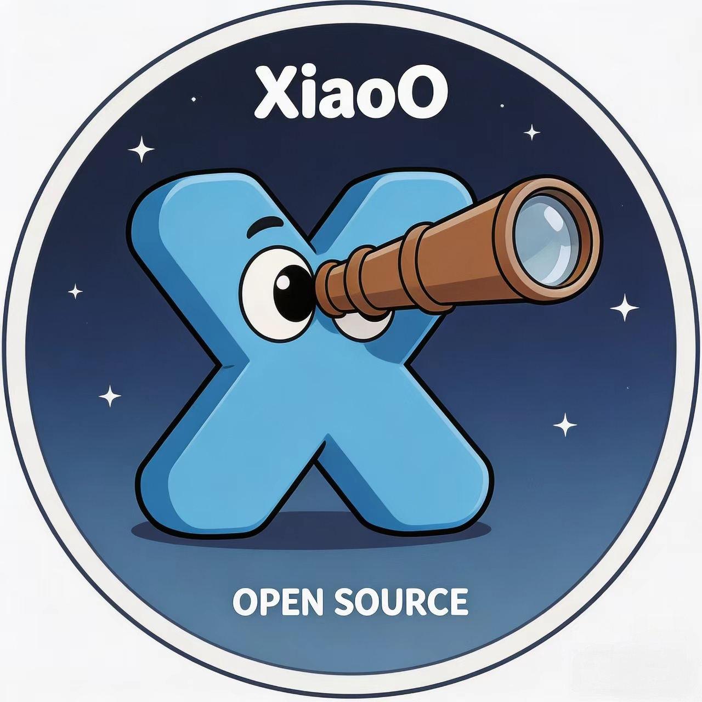

<div align="center">
  
</div>

# xiaoO

[English](./README.md) | [中文](./README.zh-CN.md)

Open-source intelligence hub for AgentOS.

[](./License)
[](https://www.rust-lang.org/)
[](https://gitcode.com/openeuler/xiaoO)

## What is xiaoO?

xiaoO is the intelligence hub of AgentOS. It provides a self-governing agent runtime for system management, agent orchestration, tool execution, memory, context compression, and multi-channel access.

At its core, xiaoO turns the operating system into a practical home for agents: files, shell commands, Git, web access, LSP diagnostics, skills, hooks, channels, and runtime telemetry are exposed through one coordinated agent loop.

The runtime also includes a layered memory and adaptive context-compression system, so long conversations, tool-heavy tasks, and multi-agent collaboration can remain stable without being overwhelmed by raw history growth.

## Key Features

- Agent runtime hub: CLI, TUI, daemon, HTTP API, and channel integrations.
- Full tool suite: file operations, shell execution, Git, web search/browse, patch application, sub-agents, and extensible tool manifests.
- Adaptive context management: token-budget tracking, configured compaction, forced recovery after context-limit errors, and prefix-cache telemetry.
- Streaming reasoning: provider reasoning/thinking deltas can be surfaced while the model works.
- Reasoning-effort tiers: switch among `off`, `high`, and `max`; the TUI cycles them with `Ctrl+T`.
- Session management: save and resume long-running work.
- LSP diagnostics: inline errors and warnings after edits through servers such as `rust-analyzer`, `pyright`, `typescript-language-server`, `gopls`, and `clangd`.
- Skills system: installable instruction packs loaded from local directories or Git sources.
- Hook and plugin system: lifecycle hook points around agent creation, LLM calls, and tool calls for audit, policy, traceability, and custom extensions.
- Observability: live token/cost tracking and trace storage through `noop`, `stdout`, or `moirai-sqlite`.
- Scheduled and triggered tasks: long-running automation workflows can be attached to the runtime.
- Localized UI: a clean terminal interface designed for daily agent work.

## Prerequisites

- Rust toolchain with Cargo installed.
- A supported LLM provider account or a local model endpoint.
- Provider credentials available through environment variables or the xiaoO configuration file.

## Installation From Source

```bash
git clone https://gitcode.com/openeuler/xiaoO.git
cd xiaoO
cargo install --path apps/endside
```

This installs the application binaries into `~/.cargo/bin` and attempts to install builtin skills. Make sure `~/.cargo/bin` is in your `PATH`.

> **Note**: `cargo build` does NOT install skills. Only `cargo install` triggers skill installation.
>
> **Installation Behavior**:
> - First attempts to install builtin skills to system-level directory: `/usr/lib/.xiaoo/skills/` (requires root privileges)
> - If system-level installation fails (e.g., permission denied), automatically falls back to user-level directory: `~/.xiaoo/skills/`
> - Builtin skills include `xiaoo-guardian` (security policy enforcement) and other built-in capabilities
> - Without these skills, security features may be unavailable.
>
> **For system-wide installation** (recommended for multi-user environments):
> - Run `cargo install` with root privileges: `sudo cargo install --path apps/endside`

### Uninstallation

```bash
# Uninstall binaries
cargo uninstall xiaoo-endside

# Remove the guardian skill (system level requires root)
sudo rm -rf /usr/lib/.xiaoo/skills/xiaoo-guardian
```

### Skill Directory Priority (Four Levels - Runtime Search Only)

Skills are searched at runtime across four directory levels (highest to lowest priority):

1. **Project level**: `./.xiaoo/skills/`
2. **Config level**: directories specified in `[skills].dirs`
3. **User level**: `~/.xiaoo/skills/`
4. **System level**: `/usr/lib/.xiaoo/skills/` (built-in skills only)

See [docs/skill_usage.md](./docs/skill_usage.md) for details.

### Build

```bash
./build.sh --release
```

The build wrapper can install the `agent_moss` hooker, a thin bridge that audits tool execution for risky operations via the resident AgentMoss HTTP service. Plugin installation details are available in [docs/plugins.md](./docs/plugins.md).

### Docker

Build a single image containing both `xiaoo` and `xiaoo-daemon`. The image
ships **no** `config.toml` — pass your own at run time via `XIAOO_CONFIG`:

```bash
docker build -t xiaoo:latest .
docker run --rm -d -p 18080:18080 -p 28081:28081 \
  -v $PWD/my.toml:/cfg.toml:ro \
  -e XIAOO_CONFIG=/cfg.toml \
  -e OPENROUTER_API_KEY=sk-or-... \
  xiaoo:latest
```

The container starts `xiaoo-daemon` by default. Pass `xiaoo` for the TUI
(`docker run -it xiaoo:latest xiaoo`) or `xiaoo --cli run -p "..."` for one-shot CLI.
See [docs/docker_deploy.md](./docs/docker_deploy.md) for full instructions.

## Quick Start

Create `~/.config/xiaoo/config.toml`:

```toml
[llm]
provider = "openrouter"              # openai, anthropic, ollama, openrouter, deepseek, zai, minimax, kimi, minimax-coding-plan, kimi-coding-plan, ...
model = "z-ai/glm-5"
api_key_env = "OPENROUTER_API_KEY"   # Read the API key from this environment variable
max_tokens = 128000                  # Optional, max output tokens per response (TUI/Daemon only; CLI ignores this field)
reasoning_effort = "off"             # Optional: off, high, or max (TUI only; CLI uses --reasoning-effort; Daemon uses HTTP API field)

# Predefined subagent roles (CLI/TUI/Daemon all support) ⭐
# Note: tools configuration supports two formats - see docs/config_file_guide.md
[subagent.code_reviewer]
description = "Code review specialist"
prompt = "You are a code review specialist focusing on quality and best practices."
max_turns = 5

[subagent.code_reviewer.tools]
bash = true
read = true
glob = true
grep = true

[trace]
storage_backend = "moirai-sqlite"    # noop, stdout, or moirai-sqlite
db_path = "~/.xiaoo/traces.db"       # Used when storage_backend is moirai-sqlite
```

Set your provider credential:

```bash
export OPENROUTER_API_KEY="sk-or-..."
```

Setup custom api url for local LLM (entry point `http://localhost:8080/v1/chat/completions`):

```toml
[llm]
provider = "local"
model = "deepseek-v4-flash"
api_base = "http://localhost:8080/v1"
api_key_env = "LLM_API_KEY"
```

> The `local` provider defaults to `http://localhost:8080/v1` already; set
> `api_base` only when your server lives on a different port or path. If you
> omit `/v1`, the OpenAI-compatible client still probes `/v1/chat/completions`
> as a fallback after `/chat/completions` fails with a 404, but specifying it
> directly avoids the extra failed request.

Run xiaoO:

```bash
# Terminal UI
xiaoo

# Single-shot CLI
xiaoo --cli run -p "Count the characters in hello world"
```

Example CLI output:

```text
"hello world" has 11 characters.
```

> **Configuration Documentation**:
> - [General Configuration Guide](docs/config_file_guide.md) - Shared configuration for all modes (llm, subagent, skills, etc.)
> - [CLI Configuration](docs/cli_config.md) - CLI basic usage and supported configuration
> - [TUI Configuration](docs/tui_config.md) - TUI-specific configuration (remote, LSP, agent roles)
> - [Daemon Configuration](docs/daemon_config.md) - Daemon-specific configuration (channels, HTTP API)

## Context Window

The effective context window is resolved dynamically. xiaoO resolves the effective value in this order:

1. Dynamic model lookup against the provider's model catalog (`/models` or equivalent). Available for any provider whose profile has `supports_model_catalog = true`, including `openai`, `anthropic`, `gemini`, `ollama`, `zai`/`zhipu`, `deepseek`, `openrouter`, `kimi`, `kimi-coding-plan`, `minimax-coding-plan`, `gitcode`, `local`, and `other`. Providers marked `supports_model_catalog = false` (e.g. `minimax`, `minimax-anthropic`) skip this step.
2. Local fallback defaults keyed off the provider's protocol family:
   - OpenAI-compatible, Ollama, and Zhipu families default to `128000`
   - Anthropic defaults to `200000`
   - Gemini defaults to `1000000`

More details are available in [Memory & Context Compression](./docs/memory_context_system.md).

## Reasoning Effort

`[llm].reasoning_effort` controls provider-side thinking or reasoning where supported.

| Value | Meaning | TUI color |
| --- | --- | --- |
| `off` | Disable extra reasoning controls where supported | Gray |
| `high` | Use a stronger reasoning/thinking setting | Yellow |
| `max` | Use the strongest reasoning/thinking setting | Red |

The TUI status bar shows the current value as `Think off/high/max`. Press `Ctrl+T` to cycle `off -> high -> max -> off` for the next turn. In CLI mode, use:

```bash
xiaoo --cli run --reasoning-effort high -p "Explain this repository"
```

Provider mapping is best-effort. OpenAI-compatible providers receive `reasoning_effort` for `high` and `max`; Anthropic receives `thinking.budget_tokens`; Gemini receives `thinkingConfig.thinkingBudget`; unsupported providers ignore the setting. `off` omits provider-specific reasoning fields so default requests keep each provider's native behavior.

## Skills

xiaoO loads skills from `~/.xiaoo/skills` by default. Each skill is a reusable instruction pack backed by `SKILL.md` or `SKILL.toml`.

```bash
xiaoo --cli skill list
xiaoo --cli skill show <name>
xiaoo --cli skill audit <path>
xiaoo --cli skill install ./my-skill/
xiaoo --cli skill install https://github.com/user/my-skill.git
xiaoo --cli skill remove <name>
```

See [docs/skill_usage.md](./docs/skill_usage.md) for the full skill workflow.

## Run as a Daemon

xiaoO can run as a daemon and expose a REST API for external systems such as Feishu, Telegram, or custom services.

```bash
# Default address: 0.0.0.0:18080
xiaoo-daemon

# Specify configuration file, host, and port
xiaoo-daemon --config /path/to/config.toml --host 127.0.0.1 --port 18080
```

HTTP requests can select an agent role preset by passing `runtime_profile_id` inside the `entry` object of the JSON body:

```json
{
  "text": "Review this patch for security issues",
  "channel": "http",
  "sender_id": "demo-user",
  "conversation_id": "demo-conv",
  "entry": {
    "kind": "http_api",
    "runtime_profile_id": "code-reviewer"
  }
}
```

More daemon configuration details are in [docs/daemon_config.md](./docs/daemon_config.md).

## More Documentation

- [Memory & Context Compression](./docs/memory_context_system.md)
- [Plugin System](./docs/plugins.md)
- [Skill Usage](./docs/skill_usage.md)
- [E2B Workspace & Skills Bootstrap](./docs/e2b_workspace_skills_bootstrap.md)
- [Custom Agents](./docs/custom_agent.md)
- [Remote TUI](./docs/remote_tui.md)
- [Feishu Deployment](./docs/feishu_deploy.md)
- [Telegram Deployment](./docs/telegram_deploy.md)
- [Docker Deployment](./docs/docker_deploy.md)

## License

xiaoO is licensed under [MulanPSL-2.0](./License).
