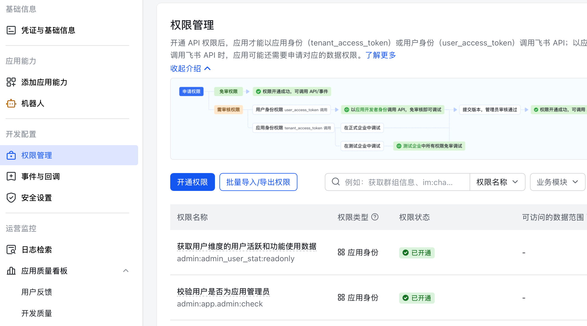
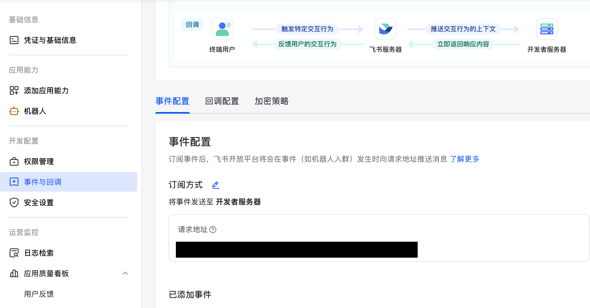
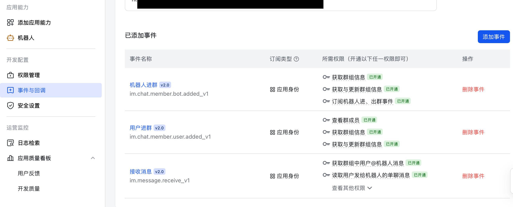

# Feishu Channel Deployment Guide

This document explains how to deploy the xiaoO Feishu channel in a way that is actually reproducible from scratch.

It covers:

- how the HTTP connection is established from Feishu to xiaoO
- which config files are used by the daemon
- how to expose the webhook safely through nginx
- how to verify URL challenge, message delivery, and reply behavior

The examples below match the currently deployed `xiaoo-rebuild` service layout on the server, but the same structure can be adapted to any host.

## 1. End-to-end Request Flow

The Feishu integration is based on **Webhook push**, not long polling and not long connection mode.

The request flow is:

```text
Feishu user sends a message
  -> Feishu platform sends HTTP POST to the public callback URL
  -> nginx receives the request on port 80/443
  -> nginx forwards the request to xiaoO on 127.0.0.1:18080
  -> xiaoO handles /api/v1/channels/feishu/events
  -> xiaoO calls Feishu OpenAPI to add reaction / update cards / send reply
```

In the current deployment, the public callback path and the internal application path are **not the same**:

- Public callback URL configured in Feishu:
  - `http://<your-domain-or-ip>/api/v1/channels/xiaoo/events`
- Internal route handled by the xiaoO app:
  - `POST /api/v1/channels/feishu/events`

nginx bridges the two.

This distinction is important. If you configure Feishu with the internal route directly, but your reverse proxy only exposes the public route, URL verification will fail.

## 2. Prerequisites

- A Feishu tenant with admin access
- A custom Feishu app with the **Bot** capability enabled
- A public domain or public server IP reachable by Feishu
- A Linux host where you can install and run `xiaoo-app daemon`
- Rust toolchain and Cargo available on that host
- `systemd` available to manage the daemon process
- `nginx` or another reverse proxy available for public ingress
- Outbound network access from xiaoO to:
  - `https://open.feishu.cn`
  - your model provider (for example OpenRouter)

## 3. Deployment Modes

There are two practical deployment modes for Feishu integration:

### Mode A: Local deployment with public callback relay

This mode is useful during development.

In this setup:

- xiaoO runs on your local machine
- Feishu still needs a **publicly reachable** callback URL
- you expose the local service through one of:
  - a reverse proxy on a public server
  - a tunnel service
  - a public test machine that forwards traffic back to your local instance

Typical flow:

```text
Feishu
  -> public callback URL
  -> relay / reverse proxy / tunnel
  -> local xiaoO daemon
```

Important:

- Feishu cannot call `127.0.0.1`, `localhost`, or a private LAN address directly
- even for local testing, you still need a public callback address

#### Optional implementation patterns for local deployment

If you are deploying locally for the first time, the hardest part is usually not xiaoO itself but choosing how Feishu reaches your local daemon.

The three most practical patterns are:

##### Pattern A1: Public server reverse proxy in front of your local machine

This is the most stable development setup if you already have a public Linux server.

Flow:

```text
Feishu
  -> http://<public-domain-or-ip>/api/v1/channels/xiaoo/events
  -> nginx on a public server
  -> relay/tunnel from that server
  -> local xiaoO daemon on 127.0.0.1:18080
```

Typical responsibilities:

- your local machine runs `xiaoo-app daemon`
- a public server exposes the callback route
- that public server forwards traffic back to your local machine through a secure relay or tunnel

This is usually the easiest pattern if:

- you want a stable public callback URL
- you do not want to expose your local machine directly
- you already have SSH or relay access to a public server

##### Pattern A2: Direct public tunnel to the local daemon

This is the fastest way to test Feishu locally.

Flow:

```text
Feishu
  -> public tunnel URL
  -> local 127.0.0.1:18080
```

In this pattern:

- xiaoO still runs locally
- a tunnel tool publishes your local daemon as a temporary public URL
- Feishu points directly to that tunnel URL

This is usually the easiest pattern if:

- you want to validate the Feishu flow quickly
- you do not need a long-lived production callback address

Be careful with path mapping:

- if the tunnel forwards the whole local HTTP server directly, Feishu can call:
  - `http://<public-tunnel-domain>/api/v1/channels/feishu/events`
- if you want to keep the public route as:
  - `http://<public-domain-or-ip>/api/v1/channels/xiaoo/events`
  then you still need a reverse proxy layer in front of the local daemon

##### Pattern A3: Local daemon behind a team relay gateway

This is common in organizations that already have an internal development ingress layer.

Flow:

```text
Feishu
  -> team-owned public gateway
  -> team relay rule for /api/v1/channels/xiaoo/events
  -> your local xiaoO daemon
```

This is usually the cleanest pattern if:

- your team already has a shared public ingress
- local developers are expected to register routes rather than expose machines directly

The important thing is not which relay product you choose, but that all four of these remain true:

1. Feishu sends to a public URL.
2. That public URL reaches your local daemon.
3. The path mapping is correct.
4. The local daemon can still call Feishu OpenAPI and the model provider outbound.

#### How to choose between the three local patterns

Use this quick rule:

- choose **Pattern A1** if you want a stable callback URL and already have a public server
- choose **Pattern A2** if you want the fastest one-person local test loop
- choose **Pattern A3** if your team already operates a shared ingress or relay platform

No matter which pattern you use, Feishu should still be configured against the **public** callback address, never your local loopback address.

### Mode B: Server deployment

This is the recommended production mode.

In this setup:

- xiaoO runs on a server
- nginx or another reverse proxy exposes a public callback URL
- Feishu calls the public route directly
- nginx forwards the request to the local daemon port

Typical flow:

```text
Feishu
  -> public server URL
  -> nginx
  -> xiaoO daemon on localhost
```

If you are deploying for long-term use, this is usually the cleaner option.

## 4. Prepare Code and Build the Binary

If you only have the source code and no existing deployment, start from the repository first.

Example:

```bash
git clone <your-repo-url> /opt/xiaoo/src
cd /opt/xiaoo/src
git checkout <your-branch>
cargo build -p xiaoo-app
```

After a successful build, the binary will usually be created at:

```text
target/debug/xiaoo-app
```

For a long-running service, copy or install that binary to a stable runtime path such as:

```text
/opt/xiaoo/bin/xiaoo-app
```

Example:

```bash
mkdir -p /opt/xiaoo/bin
install -m 755 target/debug/xiaoo-app /opt/xiaoo/bin/xiaoo-app
```

If you prefer release builds, replace the build command with:

```bash
cargo build -p xiaoo-app --release
```

and install:

```bash
install -m 755 target/release/xiaoo-app /opt/xiaoo/bin/xiaoo-app
```

## 5. Prepare Runtime Directories

Before writing config or creating the service, create the runtime layout explicitly.

Example:

```bash
mkdir -p /opt/xiaoo/bin
mkdir -p /opt/xiaoo/config
mkdir -p /opt/xiaoo/app
mkdir -p /opt/xiaoo/adt/skills
mkdir -p /var/lib/xiaoo/agents/main
```

Recommended layout:

```text
/opt/xiaoo/bin/xiaoo-app
/opt/xiaoo/config/config.toml
/opt/xiaoo/config/xiaoo.env
/opt/xiaoo/app
/opt/xiaoo/adt/skills
/var/lib/xiaoo/agents/main
```

You can adjust these paths, but the same values must be used consistently across:

- `config.toml`
- `systemd`
- `nginx`
- your deployment scripts

## 6. Create the Feishu App

1. Go to [Feishu Open Platform](https://open.feishu.cn/)
2. Create a **Custom App**
3. Add the **Bot** capability
4. In the app sidebar, confirm the bot is enabled for the scenarios you need:
   - direct message
   - group chat mention
5. Save the basic app configuration before proceeding to callback setup

Record the following values from the app settings:

| Field | Used For |
|---|---|
| App ID | `channels.feishu.app_id` in `config.toml` |
| App Secret | environment variable referenced by `channels.feishu.app_secret_env` |
| Verification Token | `channels.feishu.verification_token` in `config.toml` |

Recommended mapping:

- `App ID` -> `channels.feishu.app_id`
- `App Secret` -> `FEISHU_APP_SECRET` in your environment file
- `Verification Token` -> `channels.feishu.verification_token`

## 7. Required Permissions

At minimum, enable the permissions needed for message receive/reply:

| Permission | Purpose |
|---|---|
| `im:message:send_as_bot` | send bot replies |
| `im:message.p2p_msg:readonly` | receive direct messages |
| `im:message.group_msg:readonly` | receive group messages |
| `contact:user.base:readonly` | resolve sender identity |

If you want group member directory prompts or richer group behavior, keep the contact/user-related read permissions enabled.

After changing permissions, Feishu may require you to create and publish a new app version before the changes take effect for real message traffic.

Example Feishu permission management page:



## 8. Subscription Method and Event Subscription

In the Feishu Open Platform callback page, pay attention to the **subscription method**.

xiaoO expects:

- **Subscription Method**: `Webhook`

Do **not** choose a long-connection style mode for this deployment document.

This document assumes the following callback model:

```text
Feishu platform
  -> HTTP POST webhook
  -> public callback address
  -> xiaoO
```

In **Events & Callbacks**:

1. Choose **Webhook**
2. Confirm you are editing the correct app environment and not a stale draft app
3. Set the request URL to the public xiaoO endpoint:

```text
http://<your-domain-or-ip>/api/v1/channels/xiaoo/events
```

This address can be either:

- a public server address in production
- or a public relay/tunnel address that ultimately forwards to your local xiaoO instance in development

Example callback configuration page with the public request URL redacted:



4. Add the message event:

```text
im.message.receive_v1
```

5. Save and verify the URL

Example event subscription list showing the message receive event:



Feishu will perform URL verification by sending a challenge request. xiaoO must respond with:

```json
{"challenge":"<the same challenge string>"}
```

If this step fails, the webhook is not connected yet.

After verification succeeds:

6. Make sure the event switch is actually enabled
7. Publish a new app version if Feishu shows the callback or permission changes as draft-only

Without publishing, URL verification may pass, but real user messages may still never be delivered.

## 9. Why Reverse Proxy Is Needed

In the current deployment model, xiaoO does **not** bind directly on the public interface.

Instead:

- xiaoO listens on:
  - `127.0.0.1:18080`
- nginx listens publicly on:
  - `0.0.0.0:80` or `0.0.0.0:443`

This is recommended because:

- Feishu can reach your public address
- xiaoO itself stays on localhost
- you can host multiple bot instances behind different public paths
- you can add TLS at the nginx layer

## 10. Example nginx Routing

This is the key part many deployments miss.

In the current server layout, the public Feishu callback path for xiaoO is:

```nginx
location = /api/v1/channels/xiaoo/events {
    proxy_pass http://127.0.0.1:18080/api/v1/channels/feishu/events;
    proxy_http_version 1.1;
    proxy_set_header Host $host;
    proxy_set_header X-Real-IP $remote_addr;
    proxy_set_header X-Forwarded-For $proxy_add_x_forwarded_for;
    proxy_set_header X-Forwarded-Proto $scheme;
}
```

This means:

- Feishu sends to `/api/v1/channels/xiaoo/events`
- nginx forwards to xiaoO’s internal route `/api/v1/channels/feishu/events`

If you are hosting multiple bots on the same machine, give each one a dedicated public route.

For example:

- xiaoO:
  - `/api/v1/channels/xiaoo/events`
- another bot:
  - `/api/v1/channels/eulerclaw/events`

That avoids callback switching conflicts.

After editing nginx config, always run:

```bash
nginx -t
systemctl reload nginx
```

If nginx is not reloaded, Feishu may still be hitting an old route even though your config file looks correct on disk.

If you are creating nginx config from scratch rather than editing an existing server block, the minimum shape usually looks like:

```nginx
server {
    listen 80;
    server_name <your-domain-or-ip>;

    location = /api/v1/channels/xiaoo/events {
        proxy_pass http://127.0.0.1:18080/api/v1/channels/feishu/events;
        proxy_http_version 1.1;
        proxy_set_header Host $host;
        proxy_set_header X-Real-IP $remote_addr;
        proxy_set_header X-Forwarded-For $proxy_add_x_forwarded_for;
        proxy_set_header X-Forwarded-Proto $scheme;
    }

    location = /api/v1/health {
        proxy_pass http://127.0.0.1:18080/api/v1/health;
    }
}
```

The exact `server` wrapper can vary across environments, but the important part is that the Feishu public callback route reaches `127.0.0.1:18080/api/v1/channels/feishu/events`.

## 11. xiaoO Daemon Configuration

In the current deployment, the daemon is started by systemd and reads:

- config file:
  - `/opt/xiaoo/config/config.toml`
- environment file:
  - `/opt/xiaoo/config/xiaoo.env`

### Example `config.toml`

```toml
[llm]
provider = "openrouter"
api_base = "https://openrouter.ai/api/v1"
model = "z-ai/glm-5"
api_key_env = "OPENROUTER_API_KEY"
max_tokens = 8192

[channels.feishu]
enabled = true
app_id = "cli_xxxxxxxxxxxxx"
app_secret_env = "FEISHU_APP_SECRET"
verification_token = "xxxxxxxxxxxxxxxx"
base_url = "https://open.feishu.cn"

[agents]
default_agent_id = "main"

[[agents.list]]
id = "main"
default = true
workspace = "/opt/xiaoo/app"
agent_dir = "/var/lib/xiaoo/agents/main"

[skills]
dirs = ["/opt/xiaoo/adt/skills"]
```

### Example `xiaoo.env`

```bash
FEISHU_APP_SECRET=your-real-feishu-app-secret
OPENROUTER_API_KEY=your-real-model-key
```

Do not put the Feishu App Secret directly into `config.toml`.
Keep it in the environment file and reference it through `app_secret_env`.

## 12. systemd Service

If you are creating the service from scratch, use a full unit file instead of only the `ExecStart` line.

```ini
[Unit]
Description=xiaoO rebuild daemon
After=network.target

[Service]
Type=simple
WorkingDirectory=/opt/xiaoo
EnvironmentFile=/opt/xiaoo/config/xiaoo.env
ExecStart=/opt/xiaoo/bin/xiaoo-app daemon --config /opt/xiaoo/config/config.toml --host 127.0.0.1 --port 18080
Restart=always
RestartSec=5

[Install]
WantedBy=multi-user.target
```

A few important details:

- `--host 127.0.0.1` means xiaoO is intentionally internal-only
- nginx is responsible for public exposure
- `EnvironmentFile` is where `FEISHU_APP_SECRET` and `OPENROUTER_API_KEY` are loaded from

After creating or editing the unit file:

```bash
systemctl daemon-reload
systemctl enable --now xiaoo-rebuild.service
```

After changing either the config file or env file, restart the service:

```bash
systemctl restart xiaoo-rebuild.service
```

If you changed the environment file, a restart is required. A plain nginx reload is not enough.

## 13. HTTP Connection Establishment Checklist

If someone else wants to reproduce this deployment, these are the exact layers that must line up:

1. Feishu app has webhook mode enabled
2. Feishu callback URL points to the **public** endpoint:
   - `/api/v1/channels/xiaoo/events`
3. Public DNS or IP resolves to your server
4. Port `80` or `443` is reachable from the public internet
5. nginx has a matching `location = /api/v1/channels/xiaoo/events`
6. nginx proxies to:
   - `http://127.0.0.1:18080/api/v1/channels/feishu/events`
7. xiaoO daemon is actually listening on:
   - `127.0.0.1:18080`
8. `channels.feishu.enabled = true`
9. `app_id`, `verification_token`, and `app_secret_env` are all configured
10. the environment variable named by `app_secret_env` is actually present in the service environment
11. the daemon can reach Feishu OpenAPI and the model provider over outbound network
12. the Feishu app version has been published after adding callback/event changes

If any one of these is missing, Feishu URL verification or message delivery will fail.

## 14. Manual Verification Commands

### 14.1 Check daemon health

```bash
curl http://127.0.0.1:18080/api/v1/health
```

Expected:

```json
{"status":"ok","version":"0.1.0"}
```

### 14.2 Check public health

```bash
curl http://<your-domain-or-ip>/api/v1/health
```

### 14.3 Check Feishu challenge response

Replace the token with your real `verification_token`:

```bash
curl -X POST http://<your-domain-or-ip>/api/v1/channels/xiaoo/events \
  -H 'Content-Type: application/json' \
  --data '{"type":"url_verification","token":"YOUR_VERIFICATION_TOKEN","challenge":"probe"}'
```

Expected:

```json
{"challenge":"probe"}
```

### 14.4 Check service logs

```bash
journalctl -u xiaoo-rebuild.service -f
```

### 14.5 Check nginx callback access

```bash
grep "api/v1/channels/xiaoo/events" /var/log/nginx/access.log | tail -n 20
```

This is useful when Feishu claims the callback failed but the application logs show nothing.

### 14.6 Check nginx syntax before reload

```bash
nginx -t
```

### 14.7 Confirm the daemon process is actually running with the expected config

```bash
systemctl status xiaoo-rebuild.service
```

Look for:

- `EnvironmentFile=/opt/xiaoo/config/xiaoo.env`
- `--config /opt/xiaoo/config/config.toml`
- `--host 127.0.0.1 --port 18080`

If you are deploying from source for the first time, one extra check is worth doing:

### 14.8 Confirm the binary you installed is the one you just built

```bash
ls -l /opt/xiaoo/bin/xiaoo-app
```

and compare the timestamp with your latest build result in `target/debug/` or `target/release/`.

## 15. Message Handling Notes

xiaoO currently handles Feishu message callbacks asynchronously:

- Feishu webhook request is accepted first
- xiaoO continues processing in the background
- reply text / reaction / progress card updates are sent through Feishu OpenAPI

So the expected behavior is:

1. webhook returns `200`
2. xiaoO processes the task
3. user later sees:
   - acknowledgement reaction
   - progress card updates
   - final text reply

In group chats, users normally need to `@` the bot to make the intent explicit.
In direct messages, plain text is usually enough.

## 16. Common Failure Modes

| Symptom | Likely Cause | What to Check |
|---|---|---|
| Feishu says challenge failed | public URL does not route correctly | nginx path, daemon health, verification token |
| No request reaches xiaoO logs | callback never entered app | Feishu URL, public firewall, nginx access log |
| `invalid verification token` | token mismatch | `channels.feishu.verification_token` |
| tenant token fetch fails | wrong App Secret | `FEISHU_APP_SECRET` in env file |
| xiaoO receives challenge but not message events | event not subscribed or app not published | `im.message.receive_v1`, app release status |
| service works locally but Feishu cannot reach it | daemon bound only to localhost without proxy | nginx/public route missing |
| bot replies fail after message is received | OpenAPI call failure | app permissions, App Secret, outbound network |
| Feishu says callback configured successfully but real messages still do not arrive | draft config not published | publish a new app version in Feishu Open Platform |
| challenge succeeds but browser access works while Feishu still fails | firewall/security group issue | check public ingress on port 80/443 |

## 17. Recommended Production Layout

For a clean production deployment, use this structure:

```text
/opt/xiaoo/bin/xiaoo-app
/opt/xiaoo/config/config.toml
/opt/xiaoo/config/xiaoo.env
/opt/xiaoo/app
/etc/systemd/system/xiaoo-rebuild.service
/etc/nginx/conf.d/xiaoo.conf
```

And keep the responsibility split like this:

- Feishu platform:
  - message source
- nginx:
  - public ingress and path routing
- xiaoO daemon:
  - webhook handling and runtime execution
- Feishu OpenAPI:
  - outbound reactions, cards, and replies

## 18. Features Currently Available in Feishu

| Feature | Status | Notes |
|---|---|---|
| Text messages | Supported | group and direct message |
| Reply by bot | Supported | sent via Feishu OpenAPI |
| Reactions | Supported | used for quick acknowledgement |
| Progress cards | Supported | runtime-driven card updates |
| Group member directory | Supported | used to enrich group context |
| Skill execution | Supported | requires valid runtime skill registry |
| File/message follow-up interaction | Supported | depends on normal session continuity |

## 19. Final Deployment Checklist

Before handing the deployment to someone else, make sure they can answer **yes** to all of these:

- Do you have the correct `App ID`, `App Secret`, and `Verification Token`?
- Is the Feishu app published after adding the event subscription?
- Is the callback URL the public route, not the internal route?
- Can nginx forward that route to the xiaoO daemon?
- Did you run `nginx -t` and reload nginx after updating the route?
- Can the daemon read `FEISHU_APP_SECRET` and `OPENROUTER_API_KEY`?
- Does `curl` challenge verification return the same challenge value?
- Does `journalctl` show incoming webhook requests?
- Can the daemon reach both Feishu OpenAPI and the model provider?

If all of the above are correct, the Feishu deployment should be reproducible.
