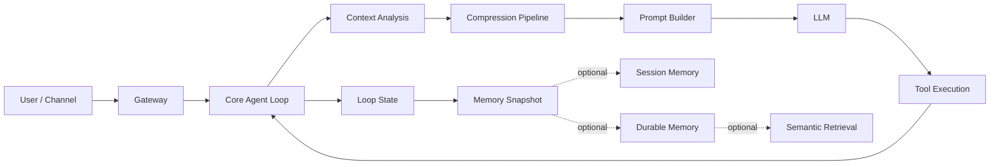

# xiaoO Memory & Context Compression

## Overview

xiaoO treats context as a managed runtime asset rather than a raw transcript. The system keeps live task state, compresses low-value history before it becomes a context-window failure, and provides a path from short-session working memory to durable and searchable long-term memory.

In practice, this gives xiaoO three core properties:

- **Layered memory**: working memory, session memory, durable memory, semantic recall.
- **Adaptive compression**: snip, collapse, and auto-compact based on token pressure.
- **Memory self-evolution**: refresh, deduplicate, merge summaries, absorb corrections, rebuild semantic indexes when needed.

## What Is Active Today

### Enabled in the default runtime

- working-memory snapshots synchronized from loop state;
- adaptive context compression in `daemon` and `cli`;
- stale tool-noise microcompression;
- multi-agent lane memory isolation;
- traceable compression and prompt-build lifecycle.

### Implemented and available for integration

- structured session memory summaries;
- durable long-term memory;
- SQLite + FTS5 + embedding hybrid retrieval;
- prompt-level memory snippet injection;
- session-memory-based prefix replacement compaction.

This distinction is important: compression is turnkey today, while deeper memory layers are currently integrated through Rust APIs.

## Runtime Flow



Runtime sequence:

1. A turn enters the agent loop.
2. xiaoO estimates history cost against the token budget.
3. If needed, it compresses history before prompt construction.
4. The latest loop state is synchronized back into `MemorySnapshot`.
5. Older context can later be promoted into session memory or durable memory.

## Key Building Blocks

### Memory model

| Type | Role |
| --- | --- |
| `MemorySnapshot` | unified live session memory: messages, facts, task state, prompt history, optional session summary |
| `MemoryManager` | updates and recalls live working memory |
| `SessionMemoryManager` | builds and persists structured session summaries |
| `DurableMemoryManager` | manages long-term memory entries |
| `RecallQuery` / `RecallPacket` | structured recall contract |

### Compression model

| Type | Role |
| --- | --- |
| `CompressionPipeline` | runtime compression contract |
| `ContextManager` | production implementation |
| `ContextAnalysis` | token-pressure analysis result |
| `CompactionPolicy` | effective history budget policy |

### Storage and retrieval contracts

| Trait | Role |
| --- | --- |
| `MemoryStore` | persists snapshots |
| `SessionMemoryStore` | persists session summaries |
| `DurableMemoryStore` | persists long-term memories |
| `SemanticMemoryStore` | hybrid vector + keyword search |
| `EmbeddingProvider` | embedding abstraction |

## Compression Behavior

xiaoO does not use one generic truncation pass. It applies staged compression:

- **Microcompact**: removes stale `tool_use` / `tool_result` pairs.
- **History Snip**: removes old low-value history while keeping protected messages.
- **Context Collapse**: replaces older ranges with a dense summary message.
- **Auto Compact**: final safety layer when history is still too large.

The compressor explicitly protects:

- the first user task message;
- tool-use/tool-result dependencies;
- recent tail messages;
- execution continuity needed for the next turn.

If the provider still returns a context-length error, xiaoO forces a compression retry and rebuilds the prompt automatically.

## Memory Self-Evolution

In xiaoO, "memory self-evolution" refers to concrete mechanisms already present in the architecture:

- every loop refreshes live memory from the newest execution state;
- compact summaries can merge old and new context instead of restarting from scratch;
- duplicate recall lines are removed and normalized;
- failures, corrections, file references, and next-step information are intentionally retained;
- semantic memory can invalidate and rebuild stale embeddings after embedding-model changes.

For long-term memory specifically, xiaoO already exposes asynchronous update and restructuring paths through the `memory` crate: durable memory can be written incrementally, replaced in batches, searched semantically, and reindexed without forcing the main runtime loop to depend on one monolithic synchronous rebuild step.

## Configuration

The default runtime currently exposes **compression settings** through daemon/CLI config. Session memory and semantic retrieval are currently configured programmatically.

Compression-related options are also described in [daemon_config.md](./daemon_config.md).

| Config | Meaning |
| --- | --- |
| `[llm].context_window` | optional explicit total context budget override for runtime token budgeting and compression |
| `[compact].warning_ratio` | warning threshold |
| `[compact].auto_compact_ratio` | context-collapse threshold |
| `[compact].blocking_ratio` | final pre-overflow threshold |
| `[compact].snip_stale_after_ms` | age threshold for snipping |
| `[compact].snip_preserve_tail` | tail preserved during snip |
| `[compact].collapse_preserve_tail` | tail preserved during collapse |
| `[compact].summary_max_tokens` | summary token budget |
| `[compact].summary_preserve_tail` | tail preserved during summary |
| `[compact].summary_llm_max_tokens` | max tokens for summary generation |

Example:

```toml
[llm]
provider = "openrouter"
model = "z-ai/glm-5"
api_key_env = "OPENROUTER_API_KEY"
context_window = 128000
max_tokens = 8192

[compact]
warning_ratio = 0.6
auto_compact_ratio = 0.75
blocking_ratio = 0.9
snip_stale_after_ms = 3600000
snip_preserve_tail = 6
collapse_preserve_tail = 4
summary_max_tokens = 1024
summary_preserve_tail = 4
summary_llm_max_tokens = 4096
```

Important boundary:

- there is **no `[memory]` TOML section yet** for durable memory or semantic retrieval;
- those features are already implemented in the `memory` crate and can be integrated directly in Rust.

## Usage Guide

### 1. Enable adaptive compression

If you only need the built-in context-management path, configure `[compact]` and optionally `[llm].context_window`. This is already wired into:

- `apps/xiaoo-app/src/daemon_runtime.rs`
- `apps/xiaoo-app/src/cli/mod.rs`
- `crates/core/src/agent_loop.rs`

Once configured, compression runs automatically before each turn.

### 2. Build session memory

Use `SessionMemoryManager` when you want a structured session summary that can later augment or replace older context.

```rust
use std::sync::Arc;

use agent_types::CompletionConfig;
use memory::{
    FilesystemSessionMemoryStore, SessionMemoryManager, SessionMemoryPolicy,
};

let store = Arc::new(FilesystemSessionMemoryStore::new("./data/memory"));
let estimator = /* Arc<dyn TokenEstimator> */;
let llm_provider = /* Arc<LlmProviderWrapper> */;

let manager = SessionMemoryManager::new(
    store,
    estimator,
    SessionMemoryPolicy {
        summary_message_limit: 64,
        summary_instruction_limit: 32,
        summary_fact_limit: 64,
        summary_prompt_history_limit: 16,
        max_section_tokens: 256,
        max_total_tokens: 1024,
    },
    llm_provider,
    CompletionConfig { max_tokens: 2048, temperature: 0.2 },
)?;

let summary = manager.build_summary(snapshot, now_ms).await?;
manager.persist_summary(&summary).await?;
```

### 3. Use durable memory without semantic search

For stable long-term memory with simple filesystem persistence:

```rust
use std::sync::Arc;

use memory::{
    DurableMemory, DurableMemoryKind, DurableMemoryManager, DurableMemoryPolicy,
    FilesystemDurableMemoryStore,
};

let store = Arc::new(FilesystemDurableMemoryStore::new("./data/memory"));
let durable = DurableMemoryManager::new(
    store,
    DurableMemoryPolicy { max_memories: 10000 },
)?;

durable.save_memory(&DurableMemory {
    memory_id: "team-style".into(),
    kind: DurableMemoryKind::Preference,
    content: "Prefer concise release notes with migration callouts.".into(),
    source: "user-preference".into(),
    updated_at: now_ms,
}).await?;
```

### 4. Use the built-in SQLite semantic store

The current vector-retrieval path in xiaoO is an embedded SQLite semantic store, not a standalone vector DB service. It combines:

- SQLite persistence;
- FTS5 full-text search;
- embedding storage;
- hybrid ranking.

Enable the `sqlite` feature on the `memory` crate:

```toml
[dependencies]
memory = { path = "../crates/memory", features = ["sqlite"] } # adjust to your workspace layout
```

Example:

```rust
use std::sync::Arc;

use memory::{
    DurableMemory, DurableMemoryKind, DurableMemoryManager, DurableMemoryPolicy,
    EmbeddingProvider, OpenAiEmbedding, SemanticMemoryStore, SemanticSearchQuery,
    SqliteDurableMemoryStore,
};

let api_key = std::env::var("OPENAI_API_KEY")?;
let embedder: Arc<dyn EmbeddingProvider> = Arc::new(
    OpenAiEmbedding::new(
        "https://api.openai.com/v1",
        &api_key,
        "text-embedding-3-large",
        3072,
    )
);

let store = Arc::new(SqliteDurableMemoryStore::new(
    "./data/memory/durable.db",
    embedder,
    0.7,   // vector weight
    0.3,   // keyword weight
    2048,  // embedding cache size
)?);

let durable = DurableMemoryManager::new(
    store.clone(),
    DurableMemoryPolicy { max_memories: 10000 },
)?;

durable.save_memory(&DurableMemory {
    memory_id: "deploy-runbook-001".into(),
    kind: DurableMemoryKind::Procedure,
    content: "Blue-green deploy requires health check verification before cutover.".into(),
    source: "ops-runbook".into(),
    updated_at: now_ms,
}).await?;

let results = store.search(&SemanticSearchQuery {
    query_text: "How do we cut over a blue-green deploy safely?".into(),
    limit: 10,
    session_id: None,
    kind_filter: Some(DurableMemoryKind::Procedure),
}).await?;
```

### 5. Build semantic recall packets

If you want semantic memory to flow into later prompt logic, use `build_recall_with_semantic()`:

```rust
use memory::{MemoryManager, RecallQuery};

let packet = memory_manager
    .build_recall_with_semantic(
        &RecallQuery {
            max_instruction_count: 16,
            max_fact_count: 32,
            max_prompt_history_count: 8,
            include_session_memory: true,
            include_durable_memory: true,
            semantic_query: Some("release workflow".into()),
            semantic_limit: 10,
        },
        &durable_memories,
        semantic_store.as_ref(),
    )
    .await?;
```

### 6. Chunk large documents before ingestion

For large Markdown assets such as runbooks or specs, chunk first and store chunk-by-chunk:

```rust
use memory::{chunk_markdown, DurableMemory, DurableMemoryKind};

let chunks = chunk_markdown(markdown_text, 512);
for chunk in chunks {
    durable.save_memory(&DurableMemory {
        memory_id: format!("runbook-{:04}", chunk.index),
        kind: DurableMemoryKind::Procedure,
        content: chunk.content,
        source: chunk.heading.as_deref().unwrap_or("runbook").to_string(),
        updated_at: now_ms,
    }).await?;
}
```

## Connecting an External Vector Database

If you want pgvector, Milvus, Weaviate, Qdrant, Elasticsearch vector search, or another external backend, the intended integration path is to implement `SemanticMemoryStore`.

Your backend should satisfy:

- `DurableMemoryStore` for CRUD;
- `SemanticMemoryStore` for `search()` and `reindex()`.

Skeleton:

```rust
#[async_trait]
impl DurableMemoryStore for MySemanticStore {
    async fn save_memory(&self, memory: &DurableMemory) -> std::io::Result<()> { /* ... */ }
    async fn load_memory(&self, memory_id: &str) -> std::io::Result<DurableMemory> { /* ... */ }
    async fn list_memories(&self) -> std::io::Result<Vec<DurableMemoryManifestEntry>> { /* ... */ }
    async fn delete_memory(&self, memory_id: &str) -> std::io::Result<()> { /* ... */ }
    async fn replace_all(&self, memories: &[DurableMemory]) -> std::io::Result<Vec<DurableMemoryManifestEntry>> { /* ... */ }
}

#[async_trait]
impl SemanticMemoryStore for MySemanticStore {
    async fn search(&self, query: &SemanticSearchQuery) -> MemoryResult<Vec<ScoredMemory>> { /* ... */ }
    async fn reindex(&self) -> MemoryResult<usize> { /* ... */ }
}
```

Recommended approach:

1. Keep `DurableMemory` as the canonical application-level model.
2. Generate embeddings via `EmbeddingProvider`, or delegate that to your backend.
3. Use your external backend for vector lookup and optional lexical lookup.
4. Return `Vec<ScoredMemory>` so the rest of the xiaoO memory pipeline stays unchanged.

Use the built-in SQLite store if you want minimal operations and embedded deployment. Build a custom semantic store if you need larger scale, distributed storage, or a specific enterprise search stack.

## Observability

xiaoO traces context-management behavior so you can answer:

- when compression triggered;
- how much history was removed;
- whether the runtime snipped or summarized;
- whether a provider context-limit error triggered recovery.

This is especially useful when tuning compaction thresholds in production.
