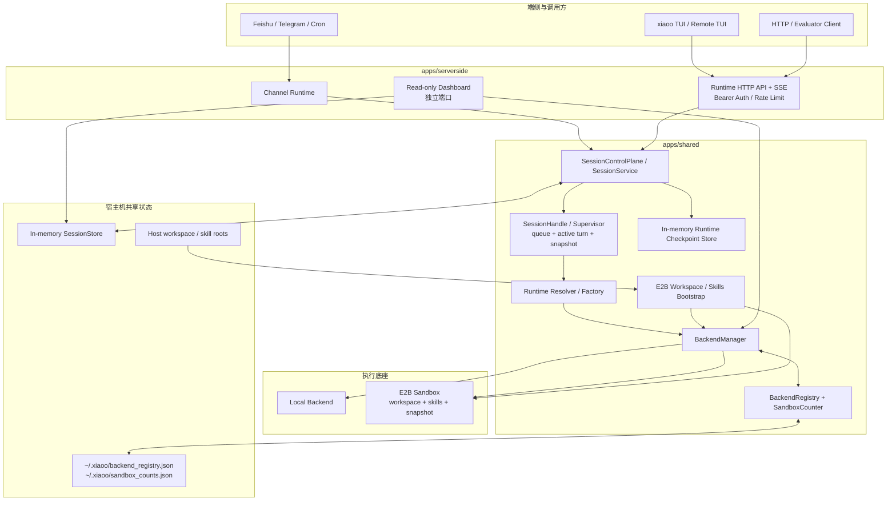
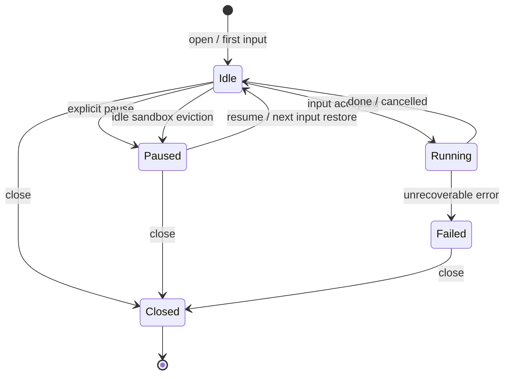

# xiaoO Super Gateway 控制面、Runtime API 与 Workspace 设计说明

| 属性 | 内容 |
| --- | --- |
| 文档版本 | v1.1 |
| 作者 | hypothesiser |
| 创建日期 | 2026-06-24 |
| 最后更新 | 2026-07-16 |
| 评审状态 | 待评审 |
| 基线版本 | `d16735b16b2d884a7a01bff68049c7f26d582703`（GitCode PR !210） |
| 当前代码基线 | `b2e9389dd8b31772ae1f32405fd8a3b16505e1fd` |
| 关联变更 | GitCode PR !218（Gateway 重构与远程运行时管理）、!220/!222（sandbox 调度及修复）、!225（daemon dashboard）、!235（runtime evaluator API）、!258（E2B 执行错误分类）；E2B workspace bootstrap：`b1aa445`、`5b58db3`、`b2e9389` |

## 1. 概述

### 1.1 背景与目标

xiaoO 已从原先相对集中的 `apps/xiaoo-app` 演进为面向端侧、服务侧和共享运行时的 Super Gateway 架构。v1.0 完成了应用目录拆分、Runtime API、远程 TUI、E2B backend 以及 checkpoint/checkout/pause/resume 等基础能力；当前版本继续补齐了以下控制面能力：

- 通过跨进程共享计数器和 backend registry 管理同一宿主机上的 E2B sandbox 配额。
- 在 sandbox 配额耗尽时，对 idle runtime 执行 checkpoint、驱逐和按需恢复。
- 新增只读 session/sandbox dashboard，提供运行态与绑定关系观测。
- 新增 runtime 级 `exec`、`read-file`、`write-file` evaluator API。
- 在首次 `open` 或 `input` 时，把 daemon 宿主机的 workspace 与 skills 快照引导到 E2B，并将 E2B 文件系统作为后续轮次的唯一真源。
- 完善 E2B 执行错误分类、部分输出保留和流式事件处理。

本版本的目标是：

1. 继续使用 runtime 作为外部控制面对象，内部保留 session、backend 和 provider sandbox 的实现分层。
2. 使 Runtime API 同时支持对话控制、生命周期控制、后端直接评测和 E2B workspace 初始化。
3. 在同一 Unix 用户启动多个 xiaoO 进程时，提供共享 sandbox 配额、活动状态、驱逐和孤儿回收能力。
4. 解决 daemon 宿主机 prompt 上下文与 E2B 实际文件系统不一致的“双源”问题。
5. 为后续持久化、多节点调度、多维资源配额、异步 operation API 和增量 workspace 同步预留演进边界。

### 1.2 范围

| 范围类别 | 说明 |
| --- | --- |
| 包含 | `apps/endside`、`apps/serverside`、`apps/shared` 分层；Runtime HTTP/SSE API；远程 TUI；local/E2B backend；checkpoint/checkout/pause/resume；runtime evaluator API；跨进程 sandbox 计数与调度；只读 dashboard；E2B workspace/skills bootstrap；相关配置、错误映射和测试。 |
| 不包含 | 持久化 session/checkpoint store；跨宿主机控制面一致性；多节点 placement；local backend 完整 snapshot/restore；workspace 双向同步；增量 bootstrap；API allowed-roots；TLS 终止；面向租户的鉴权和计费。 |

### 1.3 v1.0 到 v1.1 的主要变化

| 主题 | v1.0 | v1.1 当前实现 |
| --- | --- | --- |
| 资源上限 | daemon 内 `max_active_e2b_sandboxes` 计数 | `~/.config/xiaoo/sandbox.toml` 的 `max_sandbox_cnt`；同一宿主机、同一 Unix 用户下跨进程共享，并按 sandbox 类型和 provider key 维度计数 |
| 配额耗尽 | 直接返回资源限制错误 | 优先驱逐最早创建且全部 session idle 的 sandbox；支持跨进程通知、孤儿回收、checkpoint 后恢复 |
| 共享状态 | 进程内 backend map | 增加 `~/.xiaoo/backend_registry.json`、`sandbox_counts.json` 及文件锁；敏感 provider key 只保存派生哈希 |
| 观测 | 日志和 API 响应 | 增加独立端口、只读 session/sandbox dashboard |
| Runtime API | 对话与生命周期接口 | 增加 `exec`、`read-file`、`write-file`，并补充执行中断状态和部分输出 |
| SSE | 文本、工具、交互和结束事件 | 增加 `thinking_delta`；流式事件带 `agent_id`，可区分主 Agent 与 Subagent |
| Workspace | daemon 配置决定 workspace；E2B 可能与宿主上下文不一致 | `open`/`input` 可传 `workspace`、`skills`；首次复制到 E2B，之后以 E2B 为唯一真源 |
| Skills | daemon 本地 registry | E2B runtime 只加载 bootstrap 后远端 skill manifest，不回退读取宿主机默认 skill 目录 |

## 2. 需求分析

### 2.1 用户需求描述

作为 xiaoO 系统级用户，我希望通过统一的 Runtime API 打开运行时、提交输入、接收流式事件、直接执行评测命令和读写文件，并能够 checkpoint、checkout、pause、resume，以便在本地 TUI、远程 TUI、企业 IM、HTTP 客户端、评测系统和 E2B 环境中复用同一套 Agent 执行能力。

作为 E2B 使用者，我希望在创建 runtime 时明确指定 daemon 宿主机上的 workspace 和 skill roots，并保证模型看到的 `AGENTS.md`、repo map、skills 与工具实际操作的 E2B 文件一致。

作为 xiaoO 运维者，我希望多个 xiaoO 进程共享 provider 配额，在资源耗尽时自动回收 idle sandbox，并通过 dashboard 观察 runtime、session、sandbox 及其绑定关系。

作为 xiaoO 维护者，我希望端侧 UI、服务侧 transport、共享控制面和 provider backend 有明确边界，并为持久化、分布式调度、配额治理和性能优化保留扩展点。

### 2.2 功能性需求

| 编号 | 需求描述 | 优先级 | 当前状态/备注 |
| --- | --- | --- | --- |
| F-01 | 将端侧 TUI/CLI 能力放入 `apps/endside`。 | P0 | 已实现；端侧负责本地/远程输入、渲染、会话记录和交互。 |
| F-02 | 将 daemon、HTTP server、dashboard 和渠道接入放入 `apps/serverside`。 | P0 | 已实现；服务侧承载 HTTP/SSE、Feishu、Telegram、cron 和只读 dashboard。 |
| F-03 | 将 gateway、session、backend、checkpoint、secrets、LSP 等共享能力沉淀到 `apps/shared`。 | P0 | 已实现。 |
| F-04 | 提供 runtime 的 open、input、interaction、cancel、close API。 | P0 | 已实现；外部字段使用 `runtime_id`，核心请求兼容 legacy `session_id`。 |
| F-05 | 提供 checkpoint、checkout、pause、resume 和删除 provider snapshot API。 | P0 | 已实现；稳定快照操作要求 runtime idle。 |
| F-06 | 支持远程 TUI 通过 HTTP/SSE 连接 daemon。 | P0 | 已实现；支持 text/thinking/tool/interaction/done 等事件。 |
| F-07 | 通过 `BackendManager` 管理 backend 创建、绑定、释放、快照、恢复和 lineage。 | P0 | 已实现。 |
| F-08 | daemon 从 `[server.operation_backend]` 读取 local 或 E2B 配置。 | P0 | 已实现；顶层 `[operation_backend]` 仍保留给端侧。 |
| F-09 | E2B provider 支持命令、文件、搜索、checkpoint、checkout 和删除模板。 | P1 | 已实现；provider snapshot/template 是 E2B restore 的基础。 |
| F-10 | 只注册 `/api/v1/runtimes/*`，不再注册旧 `/api/v1/sessions/*` 路由。 | P1 | 已实现。 |
| F-11 | 提供 runtime evaluator API。 | P0 | 已实现 `exec`、`read-file`、`write-file`；均要求 runtime idle 且已有绑定 backend。 |
| F-12 | 同一宿主机上的多个进程共享 sandbox 配额和 backend 活动 registry。 | P0 | 已实现本机文件锁、预留计数、心跳、驱逐标记和启动对账。 |
| F-13 | 配额耗尽时回收 idle sandbox，并支持后续自动恢复。 | P0 | 已实现 E2B checkpoint-before-eviction、同进程驱逐、跨进程通知和孤儿回收。 |
| F-14 | 提供只读 session/sandbox dashboard。 | P1 | 已实现；默认独立监听 `127.0.0.1:28081`。 |
| F-15 | 首次创建 E2B runtime 时引导 workspace 与 skills。 | P0 | 已实现；`workspace` 和 `skills` 形成不可变 runtime binding。 |
| F-16 | checkpoint、pause/resume、checkout 继承 E2B workspace binding。 | P0 | 已实现；恢复路径使用 provider snapshot，不重新读取宿主机目录。 |

### 2.3 非功能性需求

| 编号 | 需求类型 | 描述 | 当前指标/阈值 |
| --- | --- | --- | --- |
| NF-01 | 性能 | runtime input 使用 SSE 流式返回，避免等待完整 turn。 | 支持文本与 thinking 增量；checkpoint/checkout 延迟主要取决于 provider。 |
| NF-02 | 一致性 | E2B 的 prompt、repo map、skills 和工具文件系统使用同一真源。 | bootstrap 完成后仅从 E2B 读取；manifest digest 不匹配返回 `409`。 |
| NF-03 | 安全性 | runtime 路由支持 Bearer Auth；provider 凭证不应明文落入共享 registry。 | 非 loopback 推荐启用 `[http].bearer_token_env`；E2B key 通过 PBKDF2-HMAC-SHA256 派生后再持久化索引。 |
| NF-04 | 可扩展性 | runtime API 隔离 session/backend/provider 细节。 | backend 通过 `OperationBackend` 与 `BackendManager` 扩展；当前 session runtime 仅正式接受 local/E2B。 |
| NF-05 | 兼容性 | 核心 runtime 请求兼容 legacy `session_id`。 | open/input/interaction/cancel/close 序列化为 `runtime_id`，反序列化接受 `session_id`。 |
| NF-06 | 可靠性 | 稳定快照和 evaluator 操作不得与 Agent turn 并发。 | busy runtime 映射为 HTTP `429 Too Many Requests`。 |
| NF-07 | 资源控制 | E2B live sandbox 受共享上限控制。 | 默认每个 sandbox key 20 个；配置项为 `max_sandbox_cnt`。 |
| NF-08 | 并发安全 | 多进程同时创建 sandbox 不应穿透配额。 | 创建前 reservation；reservation TTL 为 300 秒；计数和 registry 使用进程内锁与 `flock`。 |
| NF-09 | 故障恢复 | owner 进程退出后，其 sandbox 可被其他进程回收。 | 心跳周期 3 秒；30 秒未更新视为 stale owner。 |
| NF-10 | 可观测性 | 运维者可查看 session、sandbox、状态和绑定关系。 | dashboard 默认 5 秒刷新；提供 overview/sessions/sandboxes 只读接口。 |
| NF-11 | Workspace 容量 | bootstrap 需要有界，避免无限占用 daemon 临时盘和 E2B 空间。 | 最多 100,000 条目；单文件 128 MiB；普通文件总量 1 GiB。 |
| NF-12 | 数据完整性 | workspace 归档期间不得静默产生明显混合快照。 | 归档前后比较文件/目录元数据；变化时返回可重试冲突。 |

### 2.4 约束条件

- `SessionStore` 与 `RuntimeCheckpointStore` 仍是进程内存实现。daemon 重启后，runtime、手工 checkpoint、paused runtime 和会话状态丢失。
- `backend_registry.json` 与 `sandbox_counts.json` 只协调同一宿主机、同一 Unix 用户下的进程，不构成分布式一致性存储。
- E2B provider snapshot/template 位于 provider 侧；控制面记录丢失后，当前没有完整的自动枚举和反向重建能力。
- local backend 仍不支持完整文件系统 checkpoint/restore；local runtime checkout 无法获得与 E2B 等价的文件状态。
- API 级 `workspace` 和 `skills` override 当前仅对 E2B 生效；local backend 保持 daemon 配置语义。
- `workspace` 与 `skills` 是 daemon 宿主机路径，而不是远程 HTTP 客户端所在机器的路径。
- bootstrap 是单向、首次初始化快照，不是持续同步协议。
- 当前 API 信任已鉴权调用方，没有 allowed-roots；传入整个目录可能复制隐藏文件、`.git` 和敏感文件。
- dashboard 不使用 runtime API 的 Bearer Auth，必须保持 loopback 绑定或由反向代理另行保护。
- 自动驱逐前的 backend checkpoint 是 best-effort；若快照失败仍发生驱逐，session 会被标记为 paused 但可能没有可恢复 checkpoint。
- 显式 `/runtimes/resume` 尚未复用完整的 eviction-aware 重试路径；资源池满时可能直接失败。

## 3. 总体设计

### 3.1 架构概览



设计继续采用“外部 runtime、内部 session/backend/provider”的分层，同时增加资源协调与 workspace binding：

- **Runtime**：API 调用方操作的控制面对象。
- **Session**：当前 v1 的 runtime 内部承载，保存对话、生命周期、loop/memory/tool 状态和 backend 绑定。
- **Backend**：文件、命令、搜索、导出和 snapshot 能力的执行底座。
- **Provider sandbox**：E2B 等 provider 创建的实际远端实例。
- **Runtime checkpoint**：session snapshot 与 backend checkpoint ref 的组合快照。
- **Bootstrap binding**：宿主 workspace/skill roots 到 E2B 固定目录和内容摘要的不可变绑定。
- **Sandbox counter/registry**：同一宿主机多个进程共享的配额和调度状态。

### 3.2 模块划分

| 模块名称 | 职责描述 | 关键依赖 |
| --- | --- | --- |
| `apps/endside` | `xiaoo` 二进制；CLI/TUI、本地 runtime、远程 TUI、SSE 消费、交互、远程会话记录。 | `apps/shared`、`crates/core`、`crates/tool`、`crates/llm-client` |
| `apps/serverside` | `xiaoo-daemon`；Runtime HTTP API、SSE、Bearer Auth、Rate Limit、dashboard、Feishu/Telegram、cron。 | `apps/shared`、`axum`、`tower`、channel adapters |
| `apps/shared::gateway` | SessionService、SessionControlPlane、actor/supervisor、runtime resolver、workspace prompt、session store。 | core、memory、tool、skill、prompt、agent-contracts |
| `apps/shared::backend` | BackendManager、backend registry、sandbox counter、dirty tracker、local/E2B/Conch provider 代码和 lineage。 | `OperationBackend`、provider SDK/API |
| `apps/shared::runtime_checkpoint` | RuntimeRecord、checkpoint/checkout/pause/resume/evaluator API 类型和内存 checkpoint store。 | gateway、backend |
| `apps/shared::gateway::session_backend` | session backend lease、资源满时的驱逐重试、eviction checkpoint 恢复。 | BackendManager、SessionStore |
| `apps/shared::backend::backend_registry` | 持久化 backend owner、session status、last activity、heartbeat 和 pending eviction。 | 本地文件系统、`flock` |
| `apps/shared::backend::sandbox_counter` | 按 sandbox key 管理 confirmed、pending reservation 和 ghost 计数。 | 本地文件系统、PBKDF2、`flock` |
| `apps/shared::backend::e2b::bootstrap` | 校验宿主路径、构建确定性 tar、选择 skill、计算摘要。 | tar、sha2、skill loader |
| `apps/shared::gateway::e2b_runtime` | 校验远端 manifest，从 E2B 加载 `AGENTS.md`、repo map 和 skill registry。 | OperationBackend filesystem/search |
| `apps/serverside::httpserver::dashboard` | 只读 overview、sessions、sandboxes 视图和静态页面。 | SessionStore、BackendManager |

### 3.3 控制面对象关系

| 对象 | 外部可见性 | 身份/状态 | 持久化现状 |
| --- | --- | --- | --- |
| Runtime | 对外 | `runtime_id`；v1 等于内部 `session_id` | 进程内 SessionStore |
| Session | 内部为主；open/close 当前仍返回完整 `SessionRecord` | conversation、sender、lifecycle、runtime snapshot、backend binding | 进程内 |
| Backend | 管理面内部；dashboard 可观察 | `backend_id`、provider、instance、session bindings、lineage | 实例在内存；摘要写入本机 registry |
| Provider sandbox | provider 内部 | E2B sandbox id | provider 侧 |
| Runtime checkpoint | 对外使用 `checkpoint_id` | session snapshot + optional backend checkpoint | 进程内 |
| Provider snapshot | 不直接进入 RuntimeRecord | template/snapshot id | provider 侧 |
| Bootstrap binding | 随 session runtime snapshot 保存 | canonical source paths、digest、remote roots、skill manifests | 进程内 session snapshot；随 checkpoint 复制 |
| Sandbox key | 不对外 | sandbox type + provider key 的派生哈希 | 本机 JSON |

### 3.4 核心流程

#### 3.4.1 首次打开 E2B Runtime 与 Workspace Bootstrap

1. 调用方通过 `POST /api/v1/runtimes/open` 或第一次 `input` 传入 `workspace`、`skills`。
2. daemon 对非空路径执行绝对路径校验、存在性/可读性检查和 canonicalize。
3. runtime 初始化锁保证同一 runtime 的并发首次请求只执行一次 binding。
4. daemon 扫描 workspace 和最终启用 skills，构建确定性临时 tar，并计算 SHA-256。
5. `BackendManager` 先预留 sandbox 配额，再创建 E2B sandbox。
6. tar 流式上传到 E2B，远端校验摘要，解压到 staging 后原子替换目标目录。
7. 写入 `/home/user/.xiaoo/bootstrap/manifest.json`，作为安装完成标记。
8. runtime finalize 从 E2B 读取根目录 `AGENTS.md`、repo map 和 skill manifests。
9. `RuntimeBootstrapBinding` 写入 session runtime snapshot；后续请求只能省略或提供相同 binding。

#### 3.4.2 远程 TUI 输入与 SSE

1. TUI 使用 `/remote <base_url>` 健康检查并配置远程模式。
2. TUI 调用 runtime `open`，生成或复用 `runtime_id`。
3. 用户输入通过 `POST /api/v1/runtimes/input` 提交。
4. router 创建 `SseLoopEventSink` 和 `RemoteSseInteractionHandle`。
5. SessionHandle 把 turn 放入有界队列，SessionSupervisor 构建独立 runtime view 并运行 Agent loop。
6. SSE 返回 `turn_start`、`text_delta`、`thinking_delta`、`tool_result`、`interaction_requested`、`done` 等事件。
7. interaction 通过独立 POST 回传；取消请求进入 session actor 的 active turn。

#### 3.4.3 Runtime Checkpoint、Checkout、Pause 与 Resume

1. checkpoint 要求源 runtime idle。
2. 控制面读取 session snapshot，并通过 runtime/session binding 定位 backend。
3. dirty backend 创建 provider snapshot；clean backend 可复用已有 `BackendCheckpointRef`。
4. RuntimeCheckpointStore 保存 session snapshot、backend checkpoint ref、parent checkpoint 和 metadata。
5. checkout 生成 child runtime id，复制 session snapshot，并从 provider snapshot 创建 child backend。
6. pause 创建/复用 backend snapshot，释放 live backend，并把同一 runtime 置为 paused。
7. resume 从 paused checkpoint 恢复 backend，保持原 `runtime_id`。
8. checkout、pause/resume 继承 bootstrap binding，不重新读取宿主机 workspace。

#### 3.4.4 Sandbox 配额与驱逐

1. E2B 创建或 checkout 前，SandboxCounter 按 sandbox key 执行原子 reservation。
2. 若 confirmed + pending 未达到 `max_sandbox_cnt`，继续创建并在成功后 confirm；失败则 cancel reservation。
3. 若配额已满，BackendManager 从共享 registry 中选择最早创建、未被标记且所有 session idle 的 backend。
4. 若 backend 属于当前进程，先 best-effort checkpoint，再释放 sandbox，并把相关 session 标记为 paused。
5. 若 backend 属于其他存活进程，设置 `pending_eviction=true`，并通过 `SIGUSR1` 通知 owner；不支持信号时依赖 3 秒轮询。
6. 若 owner 心跳超过 30 秒未更新，其他进程可作为 orphan 直接回收 registry、counter 和 provider sandbox。
7. 创建方最多重试 5 次，每次跨进程等待 500 ms；仍无可驱逐资源时返回 SessionBusy/HTTP 429。
8. 被驱逐 runtime 下次收到 turn 时，使用 `paused_backend_checkpoint` 自动 checkout 新 sandbox。

#### 3.4.5 Runtime Evaluator

1. `exec`、`read-file`、`write-file` 先获取 idle runtime snapshot。
2. 控制面仅租用 runtime 已绑定的 live backend，不创建新的独立 session。
3. `exec` 支持 cwd、timeout、shell 和 env；stdout/stderr 使用 Base64 返回。
4. `read-file`/`write-file` 使用 Base64，避免把任意二进制强制当作 UTF-8。
5. 若 runtime running、queue 非空、closed、not found 或 backend 不存在，返回对应控制面错误。

### 3.5 生命周期状态



## 4. 设计实现

### 4.1 控制面设计

#### 4.1.1 Service 与 Control Plane

`SessionService` 负责 turn 执行和事件输出；`SessionControlPlane` 在其基础上提供生命周期和 backend 控制能力：

- open/resume session handle
- submit/cancel input
- force close
- checkpoint/checkout/pause/resume
- delete checkpoint snapshot
- runtime exec/read/write

SessionHandle 提供单 session actor、有界队列、活动 turn 状态、取消、snapshot 和 force close。SessionSupervisor 负责 runtime resolve、backend lease、loop/memory/tool 状态持久化和 registry 状态同步。

#### 4.1.2 Runtime 与 Session 的当前映射

外部请求使用 `runtime_id`；内部字段仍命名为 `session_id`，通过 serde：

```rust
#[serde(rename = "runtime_id", alias = "session_id")]
pub session_id: String,
```

该兼容适用于 open、input、interaction、cancel 和 close。checkpoint、pause、resume、exec/read/write 原生定义 `runtime_id`，不使用 legacy alias。

#### 4.1.3 当前实现与目标语义的差距

设计目标是外部只看到精简的 `RuntimeRecord`：

```rust
pub struct RuntimeRecord {
    pub runtime_id: String,
    pub conversation_id: String,
    pub sender_id: String,
    pub status: SessionLifecycleStatus,
    pub created_at_ms: u64,
    pub updated_at_ms: u64,
}
```

checkpoint/checkout/pause/resume 已返回该类型。但当前 `open` 和 `close` 仍返回完整 `SessionRecord`，其中包含 runtime snapshot 和 backend instance 等内部字段。因此“完全屏蔽 backend/provider 细节”仍是接口收敛目标，而不是已经完全达到的现状。后续版本应把 open/close 响应迁移为 `RuntimeRecord` 或显式版本化 DTO。

### 4.2 HTTP Runtime API

#### 4.2.1 路由清单

| Endpoint | Request | 当前 Response | 说明 |
| --- | --- | --- | --- |
| `GET /api/v1/health` | 无 | `GatewayHealthResponse` | 主 API 健康检查；不要求 Bearer Auth，但仍受全局 rate limit。 |
| `POST /api/v1/runtimes/open` | `RuntimeOpenRequest` | `SessionRecord` | 打开/恢复 runtime；E2B 可首次绑定 workspace/skills。 |
| `POST /api/v1/runtimes/input` | `RuntimeTurnRequest` | SSE | 提交用户输入并流式返回 Agent loop 事件。 |
| `POST /api/v1/runtimes/interaction` | `RuntimeInteractionRequest` | `204 No Content` | 响应待处理交互；无 pending interaction 返回 404。 |
| `POST /api/v1/runtimes/cancel` | `RuntimeCancelRequest` | `SseStreamEvent::Cancelled` | 请求取消 active turn。 |
| `POST /api/v1/runtimes/close` | `RuntimeCloseRequest` | `SessionRecord` | 级联关闭 child runtime，释放 backend，并 best-effort 删除相关 provider snapshots。 |
| `POST /api/v1/runtimes/checkpoint` | `RuntimeCheckpointRequest` | `RuntimeCheckpointResult` | 捕获 idle runtime 稳定快照。 |
| `POST /api/v1/runtimes/checkpoint/delete-snapshot` | `RuntimeCheckpointSnapshotDeleteRequest` | `RuntimeCheckpointSnapshotDeleteResult` | 删除 provider snapshot/template；checkpoint lineage 记录仍保留。 |
| `POST /api/v1/runtimes/checkout` | `RuntimeCheckoutRequest` | `RuntimeCheckoutResult` | 从 checkpoint 创建新的 child runtime。 |
| `POST /api/v1/runtimes/pause` | `RuntimePauseRequest` | `RuntimePauseResult` | checkpoint 后释放 live backend。 |
| `POST /api/v1/runtimes/resume` | `RuntimeResumeRequest` | `RuntimeResumeResult` | 恢复同一 runtime id。 |
| `POST /api/v1/runtimes/exec` | `RuntimeExecRequest` | `RuntimeExecResult` | 在 idle runtime 的 backend 中执行命令。 |
| `POST /api/v1/runtimes/read-file` | `RuntimeReadFileRequest` | `RuntimeReadFileResult` | 读取二进制文件并返回 Base64。 |
| `POST /api/v1/runtimes/write-file` | `RuntimeWriteFileRequest` | `RuntimeWriteFileResult` | Base64 覆盖写文件。 |

当未配置 `SessionControlPlane` 时，控制面接口返回 `501 Not Implemented` 和 `session control plane is not configured`。

#### 4.2.2 Open 与 Turn 的 Workspace 字段

`RuntimeOpenRequest` 和 `RuntimeTurnRequest` 都增加：

| 字段 | 类型 | 语义 |
| --- | --- | --- |
| `workspace` | `string \| null` | daemon 宿主机上要复制到 E2B 的绝对目录。 |
| `skills` | `string[] \| null` | 有序 skill 搜索根；每个根的一级子目录是候选 skill。 |

既有调用方省略字段即可保持 serde 兼容。`skills: []` 表示显式绑定空 skill 集；`null`/省略在已有 runtime 上表示继承绑定。

#### 4.2.3 Runtime Evaluator 类型

```rust
pub struct RuntimeExecRequest {
    pub runtime_id: String,
    pub command: String,
    pub cwd: Option<String>,
    pub timeout_ms: Option<u64>,
    pub shell: Option<String>,
    pub env: HashMap<String, String>,
}

pub struct RuntimeExecResult {
    pub stdout_base64: String,
    pub stderr_base64: String,
    pub exit_code: Option<i32>,
    pub timed_out: bool,
}
```

`RuntimeReadFileRequest` 使用 `runtime_id + path`，返回 `content_base64`。`RuntimeWriteFileRequest` 使用 `runtime_id + path + content_base64`，返回规范化后的 `path` 和 `created`。

当 provider 执行流中断时，HTTP 返回 `500`，响应额外包含：

- `execution_state`：`not_started`、`running_or_completed` 等执行状态。
- `stdout_base64`、`stderr_base64`：中断前已收到的部分输出。
- `retryable`：仅在明确 `not_started` 时为 `true`，避免客户端对可能已执行的命令盲目重试。

#### 4.2.4 SSE 事件

| Event | 关键字段 | 说明 |
| --- | --- | --- |
| `turn_start` | `agent_id`, `turn` | Agent turn 开始。 |
| `text_delta` | `agent_id`, `delta`, `snapshot` | 助手文本增量与累计快照。 |
| `thinking_delta` | `agent_id`, `delta`, `snapshot` | provider reasoning/thinking 增量。 |
| `tool_result` | `agent_id`, `call_id`, `tool_name`, `output_preview`, `is_error` | 工具结果摘要。 |
| `interaction_requested` | `request` | daemon 请求确认、文本或选项输入。 |
| `done` | reply、token、messages、stop_reason、actions 等 | turn 完成。 |
| `error` | `error` | turn 失败。 |
| `cancelled` | `runtime_id` | 取消回执。 |

#### 4.2.5 HTTP 错误映射

| HTTP 状态 | 主要条件 |
| --- | --- |
| `400 Bad Request` | workspace/skills 路径非法、Base64 或请求参数非法。 |
| `401 Unauthorized` | 保护路由缺失或使用错误 Bearer token。 |
| `404 Not Found` | runtime/checkpoint/pending interaction 不存在。 |
| `409 Conflict` | runtime binding 不一致、session closed、远端 manifest 不匹配。 |
| `413 Payload Too Large` | workspace/skills bootstrap 超出容量限制。 |
| `429 Too Many Requests` | session busy、队列/资源池无法接受请求，或 rate limit 命中。 |
| `500 Internal Server Error` | runtime resolve/build/provider/exec 等内部错误。 |
| `501 Not Implemented` | control plane 未配置或 backend capability 不支持。 |

### 4.3 E2B Workspace 与 Skills Bootstrap

#### 4.3.1 绑定语义

workspace 与 skill roots 是 runtime 级不可变 binding：

| 场景 | 请求 | 行为 |
| --- | --- | --- |
| 新 runtime | 省略 workspace/skills | 安装空 workspace 和空 skills，清除 template 可能残留的内容。 |
| 新 runtime | 指定有效路径 | canonicalize、选择 skills、归档、上传和绑定。 |
| 已有 runtime | 省略/null | 继承已有 binding，不重新复制。 |
| 已有 runtime | 与 binding 完全相同 | 接受，不重新复制。 |
| 已有 runtime | 路径或 skill root 顺序不同 | `409 Conflict`；调用方需要创建新 runtime。 |

skill roots 的顺序属于 binding 身份的一部分；同名 skill 由第一个有效候选胜出。

#### 4.3.2 E2B 固定目录

```text
/home/user/workspace/                 # workspace 唯一真源
/home/user/.xiaoo/skills/
├── 0/skill-00000/
├── 0/skill-00001/
└── 1/skill-00002/
/home/user/.xiaoo/bootstrap/
└── manifest.json
```

远端 skill 目录名是稳定归档序号，不保证保留宿主机目录名。对模型公开的 skill location、prompt indicator 和 skill directory 均使用远端路径。

#### 4.3.3 快照规则

workspace 快照包括普通文件、隐藏文件、`.git`、空目录和 Unix 权限/可执行位。owner、xattr 和时间戳不作为语义保留。

符号链接规则：

- 根目录内部的相对链接保留。
- 根目录内部的绝对链接重写为 E2B 对应绝对路径。
- 越过输入根、无法解析或指向外部的链接导致整个请求失败。
- socket、FIFO、device 等特殊文件导致整个请求失败。

归档使用流式 I/O，不把整个 workspace 读入内存；上传前计算 SHA-256，远端安装使用 staging、校验、rename 和失败回滚。

#### 4.3.4 Runtime 上下文真源

bootstrap 完成后：

- runtime workspace root 固定为 `/home/user/workspace`。
- 只读取 workspace 根目录的 `AGENTS.md`，不读取 E2B 根之外的父级说明文件。
- repo map 通过 backend glob/stat/read 从 E2B 生成。
- skill registry 从 E2B 内复制后的 manifest 重新解析。
- 后续 turn 不使用宿主机文件覆盖 E2B 修改。
- checkpoint、checkout、pause/resume 通过 provider snapshot 延续 E2B 状态。

#### 4.3.5 Custom Tools 边界

当前 E2B runtime 默认关闭 declarative/plugin filesystem custom tool source。workspace 中的 `.xiaoo/tools` 会被当作普通文件复制，但不会注册为 E2B tool manifest；built-in tools 和 MCP 不受该开关影响。local backend 保持现有 custom tools 行为。

### 4.4 资源管理与 Sandbox 调度

#### 4.4.1 当前配置

daemon backend 仍配置在主配置文件：

```toml
[server.operation_backend]
kind = "e2b"

[server.operation_backend.options]
api_key_env = "E2B_API_KEY"
template_id = "base"
timeout_secs = 3600
workspace_root = "/home/user/workspace"
home_dir = "/home/user"
temp_root = "/tmp"
default_shell = "/bin/sh"
```

共享 sandbox 上限配置已经迁移为独立文件：

```toml
# ~/.config/xiaoo/sandbox.toml
max_sandbox_cnt = 20
```

当前 `ServerConfig` 只解析 `operation_backend`。旧文档中的：

```toml
[server.resource_limits]
max_active_e2b_sandboxes = 20
```

不会被当前 daemon 读取，不应再作为有效配置示例。

#### 4.4.2 SandboxCounter

SandboxCounter 维护：

- `counts`：已确认 live sandbox 数。
- `pending_reservations`：创建中的预留，防止并发越过上限。
- `ghosts`：reservation TTL 过期后创建仍成功的补偿计数，防止释放错误地降低正常 live count。

共享文件为 `~/.xiaoo/sandbox_counts.json`，写入采用临时文件、flush、fsync、rename 的原子替换方式。

#### 4.4.3 BackendRegistry

每条 registry 记录包含：

- backend id、provider sandbox instance id 和 sandbox key。
- owner process id、OS pid 和 owner heartbeat。
- session ids 及其 status、queue depth、updated time。
- created time、last activity 和 pending eviction。

共享文件为 `~/.xiaoo/backend_registry.json`。provider API key 不明文持久化，只以确定性派生值作为计数 key。

#### 4.4.4 Dashboard

dashboard 使用独立 listener，默认 `127.0.0.1:28081`。端口冲突时最多向后尝试 100 个端口。当前只读接口为：

| Endpoint | 内容 |
| --- | --- |
| `GET /api/v1/dashboard/overview` | session/sandbox 总量、状态/provider 分布、无 sandbox session、孤儿 sandbox。 |
| `GET /api/v1/dashboard/sessions` | session card、runtime 状态、agent/model、backend 绑定、parent/checkpoint。 |
| `GET /api/v1/dashboard/sandboxes` | 当前进程 BackendManager 可见的 `BackendInfo` 列表。 |

dashboard 不提供 mutation，不与主 API 共用 Bearer Auth。

### 4.5 鉴权与限流

保护路由统一经过 Bearer Auth。配置存在时，调用方必须提供：

```text
Authorization: Bearer <token>
```

生产环境推荐使用 `[http].bearer_token_env`，避免把 token 写入配置。Rate Limit 当前应用于主 router 的全部 endpoint，包括 health、runtime 和 channel ingress。客户端身份优先读取 `X-Forwarded-For` 或 `X-Real-Ip`；部署反向代理时必须正确覆盖并清洗这些 header。

### 4.6 交付视图

#### 4.6.1 Workspace 成员

```toml
[workspace]
members = [
    "apps/shared",
    "apps/endside",
    "apps/serverside",
    "apps/vault",
    "crates/agent-types",
    "crates/agent-contracts",
    "crates/core",
    "crates/memory",
    "crates/tool",
    "crates/skill",
    "crates/mcp",
    "crates/operation_backend",
    # ...
]
```

职责边界：

- 端侧 UI/CLI 和远程渲染改动进入 `apps/endside`。
- daemon、HTTP、dashboard、channel、cron 改动进入 `apps/serverside`。
- session/runtime/backend/workspace bootstrap 和公共控制面类型进入 `apps/shared`。
- provider 无关契约、Agent loop、tool、memory、prompt、skill 等通用能力进入 `crates/*`。

#### 4.6.2 编译与启动

```bash
cargo install --path apps/endside
cargo build --package xiaoo-serverside
xiaoo-daemon --host 0.0.0.0 --port 18080 \
  --config ~/.config/xiaoo/config.toml
```

dashboard 默认在 `127.0.0.1:28081`；可通过 `[http.dashboard]` 或 `--dashboard-host/--dashboard-port` 修改。

#### 4.6.3 Workspace Open 示例

```bash
curl -X POST http://127.0.0.1:18080/api/v1/runtimes/open \
  -H "Content-Type: application/json" \
  -H "Authorization: Bearer $XIAOO_HTTP_BEARER_TOKEN" \
  -d '{
    "runtime_id": "runtime-demo",
    "conversation_id": "conv-demo",
    "sender_id": "user-demo",
    "workspace": "/srv/repos/xiaoO",
    "skills": [
      "/home/xiaoo/.xiaoo/skills",
      "/opt/company/skills"
    ]
  }'
```

#### 4.6.4 Runtime Exec 示例

```bash
curl -X POST http://127.0.0.1:18080/api/v1/runtimes/exec \
  -H "Content-Type: application/json" \
  -H "Authorization: Bearer $XIAOO_HTTP_BEARER_TOKEN" \
  -d '{
    "runtime_id": "runtime-demo",
    "command": "cargo test --workspace",
    "cwd": "/home/user/workspace",
    "timeout_ms": 120000,
    "env": {"RUST_BACKTRACE": "1"}
  }'
```

### 4.7 测试与验收建议

#### 4.7.1 单元测试

- runtime request 的 `runtime_id`/legacy `session_id` serde 行为。
- workspace/skills 的 null、空列表、canonical path、顺序和 binding 冲突。
- bootstrap 的隐藏文件、`.git`、空目录、权限、内部符号链接和容量限制。
- SandboxCounter reservation、TTL、ghost、release、startup reconcile。
- BackendRegistry 文件锁、原子写、heartbeat、session status 和 eviction mark。
- runtime evaluator 的 Base64、idle 校验、timeout 和执行中断状态。
- dashboard summary 与 DTO 映射。

#### 4.7.2 集成测试

- health、auth、rate limit 和所有 runtime route。
- open/input SSE/interaction/cancel/close。
- checkpoint/checkout/pause/resume 与 snapshot 删除。
- E2B bootstrap 后 `AGENTS.md`、repo map、skills 与远端文件一致。
- checkpoint/checkout 后 child runtime 的 workspace 隔离。
- 多进程同时创建 sandbox 不超过 `max_sandbox_cnt`。
- 配额满时同进程驱逐、跨进程 `SIGUSR1` 驱逐、stale owner 回收和自动恢复。
- daemon SIGINT/SIGTERM 下的有界 sandbox cleanup。

#### 4.7.3 当前风险

| 风险/限制 | 影响 | 建议 |
| --- | --- | --- |
| SessionStore/CheckpointStore 仅在内存 | daemon 重启后 runtime 和 lineage 丢失。 | 优先引入持久化 store 和恢复协议。 |
| 本机 JSON registry 不是事务数据库 | 多节点不可用，文件损坏时恢复能力有限。 | 演进为具备 lease/CAS 的共享控制面存储。 |
| 自动驱逐 checkpoint 为 best-effort | snapshot 失败后驱逐可能导致 runtime 无法恢复。 | checkpoint 失败默认禁止驱逐，或显式区分可丢弃 runtime。 |
| open/close 返回 SessionRecord | 暴露内部类型，阻碍后续 session/runtime 解耦。 | 版本化返回 `RuntimeRecord`。 |
| dashboard 无自身鉴权 | 错误绑定公网会暴露运行态信息。 | 默认保持 loopback；后续复用 RBAC 或独立 auth。 |
| API workspace 无 allowed-roots | 已鉴权调用方可请求复制 daemon 可读的任意目录。 | 增加 allowed-roots、路径策略和审计。 |
| 全量、未压缩 tar | 大 workspace 启动慢并占用两端临时空间。 | 增量 CAS、压缩、缓存和可恢复上传。 |
| 显式 resume 调度路径不统一 | 资源池满时行为与 next-input 自动恢复不一致。 | 所有 restore 统一走 eviction-aware allocator。 |
| local restore 不完整 | local 与 E2B 生命周期语义不对称。 | 引入 local snapshot provider 或明确 capability negotiation。 |

## 5. 后续演进

### 5.1 演进原则

1. 外部继续稳定使用 runtime、checkpoint、operation 和 workspace 语义。
2. 调度决策与 provider 创建解耦，BackendManager 逐步演进为 allocator/placement 执行器。
3. 所有需要等待 provider 的长操作都应可观测、可取消、可重试且具备幂等边界。
4. 资源治理从单一 sandbox 数量扩展为租户、优先级和多维资源配额。
5. workspace 从全量一次性复制演进为内容寻址、增量传输和受控同步。

### 5.2 近期：控制面收敛与可靠性

| 方向 | 建议能力 | 预期收益 |
| --- | --- | --- |
| 持久化 | 持久化 SessionStore、CheckpointStore、runtime lineage 和 paused head。 | daemon 重启后可恢复 runtime。 |
| API DTO | open/close 返回 RuntimeRecord；统一 error code、request id 和 operation id。 | 隔离内部 session/backend 结构。 |
| 幂等 | open、checkpoint、checkout、pause、resume 支持 `Idempotency-Key`。 | 客户端可安全重试网络失败。 |
| 恢复统一 | 显式 resume、自动 resume、checkout 共用同一 allocator/eviction retry。 | 消除资源满时的不一致行为。 |
| 安全驱逐 | checkpoint 失败则不驱逐；增加 `discardable`/`preemptible` runtime 属性。 | 避免不可恢复的数据丢失。 |
| Snapshot GC | 引用计数、保留策略、过期时间和后台 GC。 | 防止 provider template 长期泄漏。 |
| Dashboard 安全 | 独立 token、复用 RBAC 或仅通过 Unix socket 暴露。 | 降低状态信息泄露风险。 |

### 5.3 中期：资源模型与调度器

#### 5.3.1 多维资源模型

从单一 `max_sandbox_cnt` 扩展为：

| 维度 | 示例 |
| --- | --- |
| Provider 配额 | sandbox 数、snapshot 数、API QPS、并发创建数。 |
| 计算资源 | vCPU、内存、GPU 类型/显存、最大进程数。 |
| 存储资源 | workspace 容量、临时盘、snapshot 总量、上传带宽。 |
| 网络资源 | 是否允许公网、出站域名策略、带宽和连接数。 |
| Agent 资源 | 并发 turn、LLM token budget、工具调用并发、subagent 数。 |
| 组织配额 | tenant、user、project、channel、priority class。 |

控制面应采用 `request -> reserve -> bind -> heartbeat -> release` 的 lease 模型，并支持配额的 hard limit、soft limit、burst 和预留池。

#### 5.3.2 调度策略

当前“最早创建的 idle sandbox”可演进为可插拔评分调度：

```text
score = priority
      + idle_age
      + snapshot_locality
      + workspace_cache_hit
      + warm_pool_match
      - restore_cost
      - eviction_cost
      - tenant_overuse_penalty
```

建议增加：

- admission queue 与公平队列，区分交互式、定时任务和批量评测。
- priority、deadline、preemptible 和 max-wait-time。
- warm sandbox pool，按 template/model/toolchain 预热。
- workspace digest 和 provider snapshot locality 感知。
- 基于历史启动/恢复时延和失败率的 provider 选择。
- backoff、熔断和 provider health score。
- 多 runtime 共享只读基础 snapshot，写时分支。

### 5.4 中长期：分布式控制面

将本机 JSON 文件替换为具备 lease、CAS、事务和 watch 能力的共享存储。建议对象包括：

- RuntimeRecord、desired state、observed state 和 generation。
- BackendLease、owner node、heartbeat、resource allocation。
- Checkpoint metadata、snapshot reference 和引用计数。
- Workspace artifact digest、location 和 cache 状态。
- OperationRecord、阶段、进度、错误和重试次数。

在此基础上引入：

- node agent 与中心 scheduler 分层。
- 多节点 placement、故障迁移和 orphan fencing。
- leader election 或无主 CAS allocator。
- tenant-aware quota 和审计日志。
- 跨 region provider routing 与数据驻留策略。

### 5.5 Workspace 演进

| 阶段 | 能力 |
| --- | --- |
| 安全边界 | allowed-roots、deny patterns、secret scan、最大文件策略、审计日志。 |
| 传输优化 | zstd 压缩、分块、断点续传、并行上传和进度事件。 |
| 内容寻址 | workspace/skill CAS、digest 去重、host-side archive cache。 |
| 增量更新 | 基于 manifest 的 diff、runtime refresh API、乐观并发版本。 |
| 大仓库 | lazy fetch、Git object 复用、只读 volume + writable overlay。 |
| 结果回传 | export/download artifact API；受控的 patch 或 bundle 回写。 |
| 生命周期 | workspace version 与 checkpoint lineage 对齐，支持可重复构建和 provenance。 |

双向实时同步不应作为默认语义；更安全的路径是显式 `import -> run -> export/apply`，并通过版本号和冲突检测避免覆盖用户修改。

### 5.6 API 演进

建议在保持 `/api/v1/runtimes/*` 兼容的同时增加：

- `GET /runtimes/{id}`、list、status 和 lineage 查询。
- `GET /checkpoints`、snapshot GC 和 retention policy。
- `POST /runtimes/{id}/operations` 统一承载 exec、checkpoint、pause、resume、bootstrap 等长操作。
- `GET /operations/{id}` 与 SSE/WebSocket progress stream。
- 统一机器可读错误结构：`code`、`message`、`retryable`、`request_id`、`details`。
- optimistic concurrency：`generation`/`If-Match`，避免多个控制器覆盖 desired state。
- capability discovery，明确 local/E2B/未来 provider 支持的 snapshot、exec、filesystem、network 能力。
- OpenAPI、生成 SDK 和契约兼容测试。

### 5.7 性能与可观测性优化

| 方向 | 建议 |
| --- | --- |
| SSE | 使用有界队列和 backpressure；事件合并、心跳、断线续传和 event sequence。 |
| Bootstrap | 归档缓存、压缩、CAS、增量扫描和远端解压进度。 |
| Checkpoint | 异步 operation、增量 snapshot、clean checkpoint 复用率指标。 |
| Runtime 构建 | 缓存静态 tool manifest、provider client、model metadata 和 workspace repo map。 |
| 调度 | 记录排队时延、驱逐次数、恢复时延、无可驱逐资源率和 warm hit ratio。 |
| Provider | 结构化 DNS/connect/TLS/HTTP/stream 错误；按 retryable 分类重试。 |
| 存储 | checkpoint/snapshot 大小、生命周期、GC backlog 和 orphan 数量。 |
| 成本 | 按 tenant/runtime/provider 聚合 sandbox-minutes、token、snapshot 和带宽成本。 |

建议至少暴露以下 SLI：

- runtime open 成功率与 P50/P95/P99。
- first SSE event 和 first text/thinking token latency。
- sandbox create/restore/checkpoint/delete latency。
- admission wait、eviction wait 和 resume latency。
- live/pending/ghost/orphan sandbox 数。
- bootstrap bytes、files、cache hit 和 failure reason。
- checkpoint 可恢复率与 snapshot GC 成功率。

### 5.8 建议路线图

| 阶段 | 重点 | 退出条件 |
| --- | --- | --- |
| Phase 1 | 持久化 store、统一 resume/checkout allocator、安全驱逐、API DTO 收敛。 | daemon 重启后 runtime 可恢复；配额满时所有恢复路径一致。 |
| Phase 2 | Operation API、幂等、Snapshot GC、workspace allowed-roots/CAS/cache。 | 长操作可查询进度并安全重试；workspace 重复上传显著下降。 |
| Phase 3 | 多维 quota、公平队列、warm pool、可插拔调度评分。 | 支持交互/批处理混部和租户级 SLO。 |
| Phase 4 | 分布式 registry、node agent、多节点 placement 和故障迁移。 | 单节点故障不丢失控制面状态，可在其他节点恢复 runtime。 |

## 6. 参考实现位置

| 内容 | 代码/文档位置 |
| --- | --- |
| Runtime router 与错误映射 | `apps/serverside/src/httpserver/router.rs` |
| SSE 事件 | `apps/serverside/src/httpserver/sse_sink.rs` |
| SessionService/ControlPlane | `apps/shared/src/gateway/session_service.rs` |
| 控制面实现 | `apps/shared/src/gateway/session_service_impl.rs` |
| Session/backend 调度恢复 | `apps/shared/src/gateway/session_backend.rs` |
| Runtime API 类型 | `apps/shared/src/runtime_checkpoint.rs`、`apps/shared/src/gateway/session_base.rs`、`turns.rs` |
| BackendManager | `apps/shared/src/backend/backend_manager.rs` |
| SandboxCounter | `apps/shared/src/backend/sandbox_counter.rs` |
| BackendRegistry | `apps/shared/src/backend/backend_registry.rs` |
| Workspace bootstrap | `apps/shared/src/backend/e2b/bootstrap.rs` |
| E2B runtime 上下文 | `apps/shared/src/gateway/e2b_runtime.rs`、`backend_workspace_context.rs` |
| Dashboard | `apps/serverside/src/httpserver/dashboard.rs` |
| 现有专题文档 | `docs/runtime_checkpoint.md`、`docs/remote_tui.md`、`docs/e2b_workspace_skills_bootstrap.md`、`docs/daemon_config.md` |
